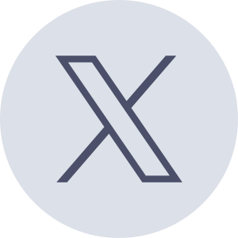

<h3 align="center">
	 
	
	Catppuccin
	
</h3>

<h6 align="center">
  <a href="https://catppuccin.com/pronunciation.mp3">/ˌkætpʊˈtʃiːn/</a>
</h6>

<h6 align="center">
  <a href="https://github.com/catppuccin/catppuccin#-palette">Palette</a>
  ·
  <a href="https://github.com/catppuccin/catppuccin#-ports-and-more">Ports</a>
  ·
  <a href="https://github.com/catppuccin/catppuccin#-showcase">Showcase</a>
  ·
  <a href="https://github.com/catppuccin/catppuccin/tree/main/docs">Docs</a>
</h6>

  

  
  
  
  

&nbsp;

Catppuccin is a community-driven pastel theme that aims to be the middle ground between low and high-contrast themes. It consists of 4 soothing warm flavors with 26 eye-candy colors each, perfect for coding, designing, and much more! In addition, this repository tracks the development of the actual color palette, <a href="https://github.com/catppuccin/catppuccin/tree/main/docs"><b>the project's documentation</b></a>, organization-wide assets, resources and code samples for maintainers/developers.

  <a href="https://github.com/catppuccin">
    <picture>
      <source srcset="assets/social/macchiato_github.svg" width="64" height="64" alt="Github Logo" media="(prefers-color-scheme: dark)"/>
      <source srcset="assets/social/latte_github.svg" width="64" height="64" alt="Github Logo" media="(prefers-color-scheme: light), (prefers-color-scheme: no-preference)"/>
      
    </picture>
  </a>
  
  <a href="https://www.npmjs.com/org/catppuccin">
    <picture>
      <source srcset="assets/social/macchiato_npm.svg" width="64" height="64" alt="NPM Logo" media="(prefers-color-scheme: dark)"/>
      <source srcset="assets/social/latte_npm.svg" width="64" height="64" alt="NPM Logo" media="(prefers-color-scheme: light), (prefers-color-scheme: no-preference)"/>
      
    </picture>
  </a>
  
  <a href="https://discord.com/servers/907385605422448742">
    <picture>
      <source srcset="assets/social/macchiato_discord.svg" width="64" height="64" alt="Discord Logo" media="(prefers-color-scheme: dark)"/>
      <source srcset="assets/social/latte_discord.svg" width="64" height="64" alt="Discord Logo" media="(prefers-color-scheme: light), (prefers-color-scheme: no-preference)"/>
      
    </picture>
  </a>
  
  <a href="https://twitter.com/catppuccintheme">
    <picture>
      <source srcset="assets/social/macchiato_twitter.svg" width="64" height="64" alt="Twitter Logo" media="(prefers-color-scheme: dark)"/>
      <source srcset="assets/social/latte_twitter.svg" width="64" height="64" alt="Twitter Logo" media="(prefers-color-scheme: light), (prefers-color-scheme: no-preference)"/>
      
    </picture>
  </a>
  
  <a href="https://fosstodon.org/@catppuccin">
    <picture>
      <source srcset="assets/social/macchiato_mastodon.svg" width="64" height="64" alt="Mastodon Logo" media="(prefers-color-scheme: dark)"/>
      <source srcset="assets/social/latte_mastodon.svg" width="64" height="64" alt="Mastodon Logo" media="(prefers-color-scheme: light), (prefers-color-scheme: no-preference)"/>
      
    </picture>
  </a>
  
  <a href="https://reddit.com/r/catppuccin">
    <picture>
      <source srcset="assets/social/macchiato_reddit.svg" width="64" height="64" alt="Reddit Logo" media="(prefers-color-scheme: dark)"/>
      <source srcset="assets/social/latte_reddit.svg" width="64" height="64" alt="Reddit Logo" media="(prefers-color-scheme: light), (prefers-color-scheme: no-preference)"/>
      
    </picture>
  </a>

Join our community!

&nbsp;

### 🧠 Design Philosophy

- **Colorful is better than colorless**: the colorfulness of something contributes to the distinction amongst the parts
  of that _something_, making it marginally easier to understand how things are structured.
- **There should be balance**: not too dull, not too bright. Suitability under various light conditions is a must.
- **Harmony is superior to dissonance**: vivacious colors must complement each other.

&nbsp;

### 🎨 Palette

**Catppuccin** consists of 4 beautiful pastel color palettes, named **flavors**. All the details can be found below. 
If you want to use them for your own project, refer to our [style guide](https://github.com/catppuccin/catppuccin/blob/main/docs/style-guide.md) for general use cases and guidelines. Additionally, you can find integrations with popular frameworks and tools in [catppuccin/palette](https://github.com/catppuccin/palette).

Already have a project making use of our palette? Don't forget to add it to
our [showcase](#-showcase) section below!
 

🌻 Latte

<table>
	<tr>
		<th></th>
		<th>Labels</th>
		<th>Hex</th>
		<th>RGB</th>
		<th>HSL</th>
	</tr>
	<tr>
		<td></td>
		<td>Rosewater</td>
		<td><code>#dc8a78</code></td>
		<td><code>rgb(220, 138, 120)</code></td>
		<td><code>hsl(11, 59%, 67%)</code></td>
	</tr>
	<tr>
		<td></td>
		<td>Flamingo</td>
		<td><code>#dd7878</code></td>
		<td><code>rgb(221, 120, 120)</code></td>
		<td><code>hsl(0, 60%, 67%)</code></td>
	</tr>
	<tr>
		<td></td>
		<td>Pink</td>
		<td><code>#ea76cb</code></td>
		<td><code>rgb(234, 118, 203)</code></td>
		<td><code>hsl(316, 73%, 69%)</code></td>
	</tr>
	<tr>
		<td></td>
		<td>Mauve</td>
		<td><code>#8839ef</code></td>
		<td><code>rgb(136, 57, 239)</code></td>
		<td><code>hsl(266, 85%, 58%)</code></td>
	</tr>
	<tr>
		<td></td>
		<td>Red</td>
		<td><code>#d20f39</code></td>
		<td><code>rgb(210, 15, 57)</code></td>
		<td><code>hsl(347, 87%, 44%)</code></td>
	</tr>
	<tr>
		<td></td>
		<td>Maroon</td>
		<td><code>#e64553</code></td>
		<td><code>rgb(230, 69, 83)</code></td>
		<td><code>hsl(355, 76%, 59%)</code></td>
	</tr>
	<tr>
		<td></td>
		<td>Peach</td>
		<td><code>#fe640b</code></td>
		<td><code>rgb(254, 100, 11)</code></td>
		<td><code>hsl(22, 99%, 52%)</code></td>
	</tr>
	<tr>
		<td></td>
		<td>Yellow</td>
		<td><code>#df8e1d</code></td>
		<td><code>rgb(223, 142, 29)</code></td>
		<td><code>hsl(35, 77%, 49%)</code></td>
	</tr>
	<tr>
		<td></td>
		<td>Green</td>
		<td><code>#40a02b</code></td>
		<td><code>rgb(64, 160, 43)</code></td>
		<td><code>hsl(109, 58%, 40%)</code></td>
	</tr>
	<tr>
		<td></td>
		<td>Teal</td>
		<td><code>#179299</code></td>
		<td><code>rgb(23, 146, 153)</code></td>
		<td><code>hsl(183, 74%, 35%)</code></td>
	</tr>
	<tr>
		<td></td>
		<td>Sky</td>
		<td><code>#04a5e5</code></td>
		<td><code>rgb(4, 165, 229)</code></td>
		<td><code>hsl(197, 97%, 46%)</code></td>
	</tr>
	<tr>
		<td></td>
		<td>Sapphire</td>
		<td><code>#209fb5</code></td>
		<td><code>rgb(32, 159, 181)</code></td>
		<td><code>hsl(189, 70%, 42%)</code></td>
	</tr>
	<tr>
		<td></td>
		<td>Blue</td>
		<td><code>#1e66f5</code></td>
		<td><code>rgb(30, 102, 245)</code></td>
		<td><code>hsl(220, 91%, 54%)</code></td>
	</tr>
	<tr>
		<td></td>
		<td>Lavender</td>
		<td><code>#7287fd</code></td>
		<td><code>rgb(114, 135, 253)</code></td>
		<td><code>hsl(231, 97%, 72%)</code></td>
	</tr>
	<tr>
		<td></td>
		<td>Text</td>
		<td><code>#4c4f69</code></td>
		<td><code>rgb(76, 79, 105)</code></td>
		<td><code>hsl(234, 16%, 35%)</code></td>
	</tr>
	<tr>
		<td></td>
		<td>Subtext1</td>
		<td><code>#5c5f77</code></td>
		<td><code>rgb(92, 95, 119)</code></td>
		<td><code>hsl(233, 13%, 41%)</code></td>
	</tr>
	<tr>
		<td></td>
		<td>Subtext0</td>
		<td><code>#6c6f85</code></td>
		<td><code>rgb(108, 111, 133)</code></td>
		<td><code>hsl(233, 10%, 47%)</code></td>
	</tr>
	<tr>
		<td></td>
		<td>Overlay2</td>
		<td><code>#7c7f93</code></td>
		<td><code>rgb(124, 127, 147)</code></td>
		<td><code>hsl(232, 10%, 53%)</code></td>
	</tr>
	<tr>
		<td></td>
		<td>Overlay1</td>
		<td><code>#8c8fa1</code></td>
		<td><code>rgb(140, 143, 161)</code></td>
		<td><code>hsl(231, 10%, 59%)</code></td>
	</tr>
	<tr>
		<td></td>
		<td>Overlay0</td>
		<td><code>#9ca0b0</code></td>
		<td><code>rgb(156, 160, 176)</code></td>
		<td><code>hsl(228, 11%, 65%)</code></td>
	</tr>
	<tr>
		<td></td>
		<td>Surface2</td>
		<td><code>#acb0be</code></td>
		<td><code>rgb(172, 176, 190)</code></td>
		<td><code>hsl(227, 12%, 71%)</code></td>
	</tr>
	<tr>
		<td></td>
		<td>Surface1</td>
		<td><code>#bcc0cc</code></td>
		<td><code>rgb(188, 192, 204)</code></td>
		<td><code>hsl(225, 14%, 77%)</code></td>
	</tr>
	<tr>
		<td></td>
		<td>Surface0</td>
		<td><code>#ccd0da</code></td>
		<td><code>rgb(204, 208, 218)</code></td>
		<td><code>hsl(223, 16%, 83%)</code></td>
	</tr>
	<tr>
		<td></td>
		<td>Base</td>
		<td><code>#eff1f5</code></td>
		<td><code>rgb(239, 241, 245)</code></td>
		<td><code>hsl(220, 23%, 95%)</code></td>
	</tr>
	<tr>
		<td></td>
		<td>Mantle</td>
		<td><code>#e6e9ef</code></td>
		<td><code>rgb(230, 233, 239)</code></td>
		<td><code>hsl(220, 22%, 92%)</code></td>
	</tr>
	<tr>
		<td></td>
		<td>Crust</td>
		<td><code>#dce0e8</code></td>
		<td><code>rgb(220, 224, 232)</code></td>
		<td><code>hsl(220, 21%, 89%)</code></td>
	</tr>
</table>

🪴 Frappé

<table>
	<tr>
		<th></th>
		<th>Labels</th>
		<th>Hex</th>
		<th>RGB</th>
		<th>HSL</th>
	</tr>
	<tr>
		<td></td>
		<td>Rosewater</td>
		<td><code>#f2d5cf</code></td>
		<td><code>rgb(242, 213, 207)</code></td>
		<td><code>hsl(10, 57%, 88%)</code></td>
	</tr>
	<tr>
		<td></td>
		<td>Flamingo</td>
		<td><code>#eebebe</code></td>
		<td><code>rgb(238, 190, 190)</code></td>
		<td><code>hsl(0, 59%, 84%)</code></td>
	</tr>
	<tr>
		<td></td>
		<td>Pink</td>
		<td><code>#f4b8e4</code></td>
		<td><code>rgb(244, 184, 228)</code></td>
		<td><code>hsl(316, 73%, 84%)</code></td>
	</tr>
	<tr>
		<td></td>
		<td>Mauve</td>
		<td><code>#ca9ee6</code></td>
		<td><code>rgb(202, 158, 230)</code></td>
		<td><code>hsl(277, 59%, 76%)</code></td>
	</tr>
	<tr>
		<td></td>
		<td>Red</td>
		<td><code>#e78284</code></td>
		<td><code>rgb(231, 130, 132)</code></td>
		<td><code>hsl(359, 68%, 71%)</code></td>
	</tr>
	<tr>
		<td></td>
		<td>Maroon</td>
		<td><code>#ea999c</code></td>
		<td><code>rgb(234, 153, 156)</code></td>
		<td><code>hsl(358, 66%, 76%)</code></td>
	</tr>
	<tr>
		<td></td>
		<td>Peach</td>
		<td><code>#ef9f76</code></td>
		<td><code>rgb(239, 159, 118)</code></td>
		<td><code>hsl(20, 79%, 70%)</code></td>
	</tr>
	<tr>
		<td></td>
		<td>Yellow</td>
		<td><code>#e5c890</code></td>
		<td><code>rgb(229, 200, 144)</code></td>
		<td><code>hsl(40, 62%, 73%)</code></td>
	</tr>
	<tr>
		<td></td>
		<td>Green</td>
		<td><code>#a6d189</code></td>
		<td><code>rgb(166, 209, 137)</code></td>
		<td><code>hsl(96, 44%, 68%)</code></td>
	</tr>
	<tr>
		<td></td>
		<td>Teal</td>
		<td><code>#81c8be</code></td>
		<td><code>rgb(129, 200, 190)</code></td>
		<td><code>hsl(172, 39%, 65%)</code></td>
	</tr>
	<tr>
		<td></td>
		<td>Sky</td>
		<td><code>#99d1db</code></td>
		<td><code>rgb(153, 209, 219)</code></td>
		<td><code>hsl(189, 48%, 73%)</code></td>
	</tr>
	<tr>
		<td></td>
		<td>Sapphire</td>
		<td><code>#85c1dc</code></td>
		<td><code>rgb(133, 193, 220)</code></td>
		<td><code>hsl(199, 55%, 69%)</code></td>
	</tr>
	<tr>
		<td></td>
		<td>Blue</td>
		<td><code>#8caaee</code></td>
		<td><code>rgb(140, 170, 238)</code></td>
		<td><code>hsl(222, 74%, 74%)</code></td>
	</tr>
	<tr>
		<td></td>
		<td>Lavender</td>
		<td><code>#babbf1</code></td>
		<td><code>rgb(186, 187, 241)</code></td>
		<td><code>hsl(239, 66%, 84%)</code></td>
	</tr>
	<tr>
		<td></td>
		<td>Text</td>
		<td><code>#c6d0f5</code></td>
		<td><code>rgb(198, 208, 245)</code></td>
		<td><code>hsl(227, 70%, 87%)</code></td>
	</tr>
	<tr>
		<td></td>
		<td>Subtext1</td>
		<td><code>#b5bfe2</code></td>
		<td><code>rgb(181, 191, 226)</code></td>
		<td><code>hsl(227, 44%, 80%)</code></td>
	</tr>
	<tr>
		<td></td>
		<td>Subtext0</td>
		<td><code>#a5adce</code></td>
		<td><code>rgb(165, 173, 206)</code></td>
		<td><code>hsl(228, 29%, 73%)</code></td>
	</tr>
	<tr>
		<td></td>
		<td>Overlay2</td>
		<td><code>#949cbb</code></td>
		<td><code>rgb(148, 156, 187)</code></td>
		<td><code>hsl(228, 22%, 66%)</code></td>
	</tr>
	<tr>
		<td></td>
		<td>Overlay1</td>
		<td><code>#838ba7</code></td>
		<td><code>rgb(131, 139, 167)</code></td>
		<td><code>hsl(227, 17%, 58%)</code></td>
	</tr>
	<tr>
		<td></td>
		<td>Overlay0</td>
		<td><code>#737994</code></td>
		<td><code>rgb(115, 121, 148)</code></td>
		<td><code>hsl(229, 13%, 52%)</code></td>
	</tr>
	<tr>
		<td></td>
		<td>Surface2</td>
		<td><code>#626880</code></td>
		<td><code>rgb(98, 104, 128)</code></td>
		<td><code>hsl(228, 13%, 44%)</code></td>
	</tr>
	<tr>
		<td></td>
		<td>Surface1</td>
		<td><code>#51576d</code></td>
		<td><code>rgb(81, 87, 109)</code></td>
		<td><code>hsl(227, 15%, 37%)</code></td>
	</tr>
	<tr>
		<td></td>
		<td>Surface0</td>
		<td><code>#414559</code></td>
		<td><code>rgb(65, 69, 89)</code></td>
		<td><code>hsl(230, 16%, 30%)</code></td>
	</tr>
	<tr>
		<td></td>
		<td>Base</td>
		<td><code>#303446</code></td>
		<td><code>rgb(48, 52, 70)</code></td>
		<td><code>hsl(229, 19%, 23%)</code></td>
	</tr>
	<tr>
		<td></td>
		<td>Mantle</td>
		<td><code>#292c3c</code></td>
		<td><code>rgb(41, 44, 60)</code></td>
		<td><code>hsl(231, 19%, 20%)</code></td>
	</tr>
	<tr>
		<td></td>
		<td>Crust</td>
		<td><code>#232634</code></td>
		<td><code>rgb(35, 38, 52)</code></td>
		<td><code>hsl(229, 20%, 17%)</code></td>
	</tr>
</table>

🌺 Macchiato

<table>
	<tr>
		<th></th>
		<th>Labels</th>
		<th>Hex</th>
		<th>RGB</th>
		<th>HSL</th>
	</tr>
	<tr>
		<td></td>
		<td>Rosewater</td>
		<td><code>#f4dbd6</code></td>
		<td><code>rgb(244, 219, 214)</code></td>
		<td><code>hsl(10, 58%, 90%)</code></td>
	</tr>
	<tr>
		<td></td>
		<td>Flamingo</td>
		<td><code>#f0c6c6</code></td>
		<td><code>rgb(240, 198, 198)</code></td>
		<td><code>hsl(0, 58%, 86%)</code></td>
	</tr>
	<tr>
		<td></td>
		<td>Pink</td>
		<td><code>#f5bde6</code></td>
		<td><code>rgb(245, 189, 230)</code></td>
		<td><code>hsl(316, 74%, 85%)</code></td>
	</tr>
	<tr>
		<td></td>
		<td>Mauve</td>
		<td><code>#c6a0f6</code></td>
		<td><code>rgb(198, 160, 246)</code></td>
		<td><code>hsl(267, 83%, 80%)</code></td>
	</tr>
	<tr>
		<td></td>
		<td>Red</td>
		<td><code>#ed8796</code></td>
		<td><code>rgb(237, 135, 150)</code></td>
		<td><code>hsl(351, 74%, 73%)</code></td>
	</tr>
	<tr>
		<td></td>
		<td>Maroon</td>
		<td><code>#ee99a0</code></td>
		<td><code>rgb(238, 153, 160)</code></td>
		<td><code>hsl(355, 71%, 77%)</code></td>
	</tr>
	<tr>
		<td></td>
		<td>Peach</td>
		<td><code>#f5a97f</code></td>
		<td><code>rgb(245, 169, 127)</code></td>
		<td><code>hsl(21, 86%, 73%)</code></td>
	</tr>
	<tr>
		<td></td>
		<td>Yellow</td>
		<td><code>#eed49f</code></td>
		<td><code>rgb(238, 212, 159)</code></td>
		<td><code>hsl(40, 70%, 78%)</code></td>
	</tr>
	<tr>
		<td></td>
		<td>Green</td>
		<td><code>#a6da95</code></td>
		<td><code>rgb(166, 218, 149)</code></td>
		<td><code>hsl(105, 48%, 72%)</code></td>
	</tr>
	<tr>
		<td></td>
		<td>Teal</td>
		<td><code>#8bd5ca</code></td>
		<td><code>rgb(139, 213, 202)</code></td>
		<td><code>hsl(171, 47%, 69%)</code></td>
	</tr>
	<tr>
		<td></td>
		<td>Sky</td>
		<td><code>#91d7e3</code></td>
		<td><code>rgb(145, 215, 227)</code></td>
		<td><code>hsl(189, 59%, 73%)</code></td>
	</tr>
	<tr>
		<td></td>
		<td>Sapphire</td>
		<td><code>#7dc4e4</code></td>
		<td><code>rgb(125, 196, 228)</code></td>
		<td><code>hsl(199, 66%, 69%)</code></td>
	</tr>
	<tr>
		<td></td>
		<td>Blue</td>
		<td><code>#8aadf4</code></td>
		<td><code>rgb(138, 173, 244)</code></td>
		<td><code>hsl(220, 83%, 75%)</code></td>
	</tr>
	<tr>
		<td></td>
		<td>Lavender</td>
		<td><code>#b7bdf8</code></td>
		<td><code>rgb(183, 189, 248)</code></td>
		<td><code>hsl(234, 82%, 85%)</code></td>
	</tr>
	<tr>
		<td></td>
		<td>Text</td>
		<td><code>#cad3f5</code></td>
		<td><code>rgb(202, 211, 245)</code></td>
		<td><code>hsl(227, 68%, 88%)</code></td>
	</tr>
	<tr>
		<td></td>
		<td>Subtext1</td>
		<td><code>#b8c0e0</code></td>
		<td><code>rgb(184, 192, 224)</code></td>
		<td><code>hsl(228, 39%, 80%)</code></td>
	</tr>
	<tr>
		<td></td>
		<td>Subtext0</td>
		<td><code>#a5adcb</code></td>
		<td><code>rgb(165, 173, 203)</code></td>
		<td><code>hsl(227, 27%, 72%)</code></td>
	</tr>
	<tr>
		<td></td>
		<td>Overlay2</td>
		<td><code>#939ab7</code></td>
		<td><code>rgb(147, 154, 183)</code></td>
		<td><code>hsl(228, 20%, 65%)</code></td>
	</tr>
	<tr>
		<td></td>
		<td>Overlay1</td>
		<td><code>#8087a2</code></td>
		<td><code>rgb(128, 135, 162)</code></td>
		<td><code>hsl(228, 15%, 57%)</code></td>
	</tr>
	<tr>
		<td></td>
		<td>Overlay0</td>
		<td><code>#6e738d</code></td>
		<td><code>rgb(110, 115, 141)</code></td>
		<td><code>hsl(230, 12%, 49%)</code></td>
	</tr>
	<tr>
		<td></td>
		<td>Surface2</td>
		<td><code>#5b6078</code></td>
		<td><code>rgb(91, 96, 120)</code></td>
		<td><code>hsl(230, 14%, 41%)</code></td>
	</tr>
	<tr>
		<td></td>
		<td>Surface1</td>
		<td><code>#494d64</code></td>
		<td><code>rgb(73, 77, 100)</code></td>
		<td><code>hsl(231, 16%, 34%)</code></td>
	</tr>
	<tr>
		<td></td>
		<td>Surface0</td>
		<td><code>#363a4f</code></td>
		<td><code>rgb(54, 58, 79)</code></td>
		<td><code>hsl(230, 19%, 26%)</code></td>
	</tr>
	<tr>
		<td></td>
		<td>Base</td>
		<td><code>#24273a</code></td>
		<td><code>rgb(36, 39, 58)</code></td>
		<td><code>hsl(232, 23%, 18%)</code></td>
	</tr>
	<tr>
		<td></td>
		<td>Mantle</td>
		<td><code>#1e2030</code></td>
		<td><code>rgb(30, 32, 48)</code></td>
		<td><code>hsl(233, 23%, 15%)</code></td>
	</tr>
	<tr>
		<td></td>
		<td>Crust</td>
		<td><code>#181926</code></td>
		<td><code>rgb(24, 25, 38)</code></td>
		<td><code>hsl(236, 23%, 12%)</code></td>
	</tr>
</table>

🌿 Mocha

<table>
	<tr>
		<th></th>
		<th>Labels</th>
		<th>Hex</th>
		<th>RGB</th>
		<th>HSL</th>
	</tr>
	<tr>
		<td></td>
		<td>Rosewater</td>
		<td><code>#f5e0dc</code></td>
		<td><code>rgb(245, 224, 220)</code></td>
		<td><code>hsl(10, 56%, 91%)</code></td>
	</tr>
	<tr>
		<td></td>
		<td>Flamingo</td>
		<td><code>#f2cdcd</code></td>
		<td><code>rgb(242, 205, 205)</code></td>
		<td><code>hsl(0, 59%, 88%)</code></td>
	</tr>
	<tr>
		<td></td>
		<td>Pink</td>
		<td><code>#f5c2e7</code></td>
		<td><code>rgb(245, 194, 231)</code></td>
		<td><code>hsl(316, 72%, 86%)</code></td>
	</tr>
	<tr>
		<td></td>
		<td>Mauve</td>
		<td><code>#cba6f7</code></td>
		<td><code>rgb(203, 166, 247)</code></td>
		<td><code>hsl(267, 84%, 81%)</code></td>
	</tr>
	<tr>
		<td></td>
		<td>Red</td>
		<td><code>#f38ba8</code></td>
		<td><code>rgb(243, 139, 168)</code></td>
		<td><code>hsl(343, 81%, 75%)</code></td>
	</tr>
	<tr>
		<td></td>
		<td>Maroon</td>
		<td><code>#eba0ac</code></td>
		<td><code>rgb(235, 160, 172)</code></td>
		<td><code>hsl(350, 65%, 77%)</code></td>
	</tr>
	<tr>
		<td></td>
		<td>Peach</td>
		<td><code>#fab387</code></td>
		<td><code>rgb(250, 179, 135)</code></td>
		<td><code>hsl(23, 92%, 75%)</code></td>
	</tr>
	<tr>
		<td></td>
		<td>Yellow</td>
		<td><code>#f9e2af</code></td>
		<td><code>rgb(249, 226, 175)</code></td>
		<td><code>hsl(41, 86%, 83%)</code></td>
	</tr>
	<tr>
		<td></td>
		<td>Green</td>
		<td><code>#a6e3a1</code></td>
		<td><code>rgb(166, 227, 161)</code></td>
		<td><code>hsl(115, 54%, 76%)</code></td>
	</tr>
	<tr>
		<td></td>
		<td>Teal</td>
		<td><code>#94e2d5</code></td>
		<td><code>rgb(148, 226, 213)</code></td>
		<td><code>hsl(170, 57%, 73%)</code></td>
	</tr>
	<tr>
		<td></td>
		<td>Sky</td>
		<td><code>#89dceb</code></td>
		<td><code>rgb(137, 220, 235)</code></td>
		<td><code>hsl(189, 71%, 73%)</code></td>
	</tr>
	<tr>
		<td></td>
		<td>Sapphire</td>
		<td><code>#74c7ec</code></td>
		<td><code>rgb(116, 199, 236)</code></td>
		<td><code>hsl(199, 76%, 69%)</code></td>
	</tr>
	<tr>
		<td></td>
		<td>Blue</td>
		<td><code>#89b4fa</code></td>
		<td><code>rgb(137, 180, 250)</code></td>
		<td><code>hsl(217, 92%, 76%)</code></td>
	</tr>
	<tr>
		<td></td>
		<td>Lavender</td>
		<td><code>#b4befe</code></td>
		<td><code>rgb(180, 190, 254)</code></td>
		<td><code>hsl(232, 97%, 85%)</code></td>
	</tr>
	<tr>
		<td></td>
		<td>Text</td>
		<td><code>#cdd6f4</code></td>
		<td><code>rgb(205, 214, 244)</code></td>
		<td><code>hsl(226, 64%, 88%)</code></td>
	</tr>
	<tr>
		<td></td>
		<td>Subtext1</td>
		<td><code>#bac2de</code></td>
		<td><code>rgb(186, 194, 222)</code></td>
		<td><code>hsl(227, 35%, 80%)</code></td>
	</tr>
	<tr>
		<td></td>
		<td>Subtext0</td>
		<td><code>#a6adc8</code></td>
		<td><code>rgb(166, 173, 200)</code></td>
		<td><code>hsl(228, 24%, 72%)</code></td>
	</tr>
	<tr>
		<td></td>
		<td>Overlay2</td>
		<td><code>#9399b2</code></td>
		<td><code>rgb(147, 153, 178)</code></td>
		<td><code>hsl(228, 17%, 64%)</code></td>
	</tr>
	<tr>
		<td></td>
		<td>Overlay1</td>
		<td><code>#7f849c</code></td>
		<td><code>rgb(127, 132, 156)</code></td>
		<td><code>hsl(230, 13%, 55%)</code></td>
	</tr>
	<tr>
		<td></td>
		<td>Overlay0</td>
		<td><code>#6c7086</code></td>
		<td><code>rgb(108, 112, 134)</code></td>
		<td><code>hsl(231, 11%, 47%)</code></td>
	</tr>
	<tr>
		<td></td>
		<td>Surface2</td>
		<td><code>#585b70</code></td>
		<td><code>rgb(88, 91, 112)</code></td>
		<td><code>hsl(233, 12%, 39%)</code></td>
	</tr>
	<tr>
		<td></td>
		<td>Surface1</td>
		<td><code>#45475a</code></td>
		<td><code>rgb(69, 71, 90)</code></td>
		<td><code>hsl(234, 13%, 31%)</code></td>
	</tr>
	<tr>
		<td></td>
		<td>Surface0</td>
		<td><code>#313244</code></td>
		<td><code>rgb(49, 50, 68)</code></td>
		<td><code>hsl(237, 16%, 23%)</code></td>
	</tr>
	<tr>
		<td></td>
		<td>Base</td>
		<td><code>#1e1e2e</code></td>
		<td><code>rgb(30, 30, 46)</code></td>
		<td><code>hsl(240, 21%, 15%)</code></td>
	</tr>
	<tr>
		<td></td>
		<td>Mantle</td>
		<td><code>#181825</code></td>
		<td><code>rgb(24, 24, 37)</code></td>
		<td><code>hsl(240, 21%, 12%)</code></td>
	</tr>
	<tr>
		<td></td>
		<td>Crust</td>
		<td><code>#11111b</code></td>
		<td><code>rgb(17, 17, 27)</code></td>
		<td><code>hsl(240, 23%, 9%)</code></td>
	</tr>
</table>

&nbsp;

### 👐 Contributing

> [!NOTE] 
> If you would like to submit a port or learn how to port Catppuccin to a program, please refer to
> the [port-creation.md](https://github.com/catppuccin/catppuccin/blob/main/docs/port-creation.md)

See [CONTRIBUTING.md](https://github.com/catppuccin/catppuccin/blob/main/CONTRIBUTING.md)

&nbsp;

### 🪵 Ports and more!

Catppuccin is available for various apps and in different formats. Here is a list of them:

<!-- AUTOGEN:PORTLIST START -->
<!-- the following section is auto-generated, do not edit -->

👾 Code Editors & IDEs

- [Binary Ninja](https://github.com/catppuccin/binary-ninja)
- [CodeMirror](https://github.com/catppuccin/codemirror)
- [Cutter](https://github.com/catppuccin/cutter)
- [DrRacket](https://github.com/catppuccin/drracket)
- [Emacs](https://github.com/catppuccin/emacs)
- [Geany](https://github.com/catppuccin/geany)
- [Gedit](https://github.com/catppuccin/gedit)
- [Ghidra](https://github.com/catppuccin/ghidra)
- [GNOME Text Editor](https://github.com/catppuccin/gnome-text-editor)
- [Helix](https://github.com/catppuccin/helix)
- [IDA (Interactive Disassembler)](https://github.com/catppuccin/ida-debugger)
- [JetBrains](https://github.com/catppuccin/jetbrains)
- [JetBrains Fleet](https://github.com/catppuccin/fleet)
- [JetBrains Icons](https://github.com/catppuccin/jetbrains-icons)
- [Kakoune](https://github.com/catppuccin/kakoune)
- [Lapce](https://github.com/catppuccin/lapce)
- [micro](https://github.com/catppuccin/micro)
- [Neovim](https://github.com/catppuccin/nvim)
- [Notepad++](https://github.com/catppuccin/notepad-plus-plus)
- [Nova](https://github.com/catppuccin/nova)
- [Qt Creator](https://github.com/catppuccin/qtcreator)
- [Replit](https://github.com/catppuccin/replit)
- [RStudio](https://github.com/catppuccin/rstudio)
- [Spyder](https://github.com/catppuccin/spyder)
- [Sublime Text](https://github.com/catppuccin/sublime-text)
- [Vim](https://github.com/catppuccin/vim)
- [Visual Studio](https://github.com/catppuccin/visual-studio)
- [Visual Studio Code](https://github.com/catppuccin/vscode)
- [Visual Studio Code Icons](https://github.com/catppuccin/vscode-icons)
- [Xcode](https://github.com/catppuccin/xcode)
- [Xed](https://github.com/catppuccin/xed)
- [Zed](https://github.com/catppuccin/zed)
- [Zed Icons](https://github.com/catppuccin/zed-icons)

💭 Development Tools

- [boringproxy](https://github.com/catppuccin/userstyles/tree/main/styles/boringproxy)
- [Codeberg](https://github.com/catppuccin/userstyles/tree/main/styles/codeberg)
- [daisyUI](https://github.com/catppuccin/daisyui)
- [docs.rs](https://github.com/catppuccin/userstyles/tree/main/styles/docs.rs)
- [egui](https://github.com/catppuccin/egui)
- [freedesktop.org](https://github.com/catppuccin/userstyles/tree/main/styles/freedesktop)
- [Fyne](https://github.com/catppuccin/fyne)
- [GitHub](https://github.com/catppuccin/userstyles/tree/main/styles/github)
- [gleam.run](https://github.com/catppuccin/userstyles/tree/main/styles/gleam.run)
- [go.dev](https://github.com/catppuccin/userstyles/tree/main/styles/go.dev)
- [Grabify](https://github.com/catppuccin/userstyles/tree/main/styles/grabify)
- [Graphite](https://github.com/catppuccin/userstyles/tree/main/styles/graphite)
- [Home Manager Options Search](https://github.com/catppuccin/userstyles/tree/main/styles/home-manager-options-search)
- [Hoogle](https://github.com/catppuccin/userstyles/tree/main/styles/hoogle)
- [Hoppscotch](https://github.com/catppuccin/userstyles/tree/main/styles/hoppscotch)
- [ImHex](https://github.com/catppuccin/imhex)
- [Insomnia](https://github.com/catppuccin/insomnia)
- [iSH](https://github.com/catppuccin/ish)
- [JupyterLab](https://github.com/catppuccin/jupyterlab)
- [Keyoxide](https://github.com/catppuccin/userstyles/tree/main/styles/keyoxide)
- [KiCad](https://github.com/catppuccin/kicad)
- [Learn X in Y Minutes](https://github.com/catppuccin/userstyles/tree/main/styles/learn-x-in-y-minutes)
- [Matplotlib](https://github.com/catppuccin/python)
- [MDN](https://github.com/catppuccin/userstyles/tree/main/styles/mdn)
- [Next.js](https://github.com/catppuccin/userstyles/tree/main/styles/vercel)
- [NixOS Manual](https://github.com/catppuccin/userstyles/tree/main/styles/nixos-manual)
- [Nixpkgs Manual](https://github.com/catppuccin/userstyles/tree/main/styles/nixos-manual)
- [Pantone](https://github.com/catppuccin/pantone)
- [paste.rs](https://github.com/catppuccin/userstyles/tree/main/styles/paste.rs)
- [PowerShell](https://github.com/catppuccin/powershell)
- [PythonAnywhere](https://github.com/catppuccin/userstyles/tree/main/styles/pythonanywhere)
- [React.dev](https://github.com/catppuccin/userstyles/tree/main/styles/react.dev)
- [shadcn/ui](https://github.com/catppuccin/shadcn-ui)
- [Tailwind CSS](https://github.com/catppuccin/tailwindcss)
- [Trinket](https://github.com/catppuccin/userstyles/tree/main/styles/trinket)
- [Vercel](https://github.com/catppuccin/userstyles/tree/main/styles/vercel)
- [VSCord](https://github.com/catppuccin/vscord)
- [web.dev](https://github.com/catppuccin/userstyles/tree/main/styles/web.dev)

📜 Documentation Generators

- [Docsify](https://github.com/catppuccin/docsify)
- [mdBook](https://github.com/catppuccin/mdBook)
- [mdBook](https://github.com/catppuccin/userstyles/tree/main/styles/mdbook)
- [Starlight](https://github.com/catppuccin/starlight)
- [VitePress](https://github.com/catppuccin/vitepress)

🖍️ Syntax Highlighting

- [Chroma](https://github.com/catppuccin/chroma)
- [Glamour](https://github.com/catppuccin/glamour)
- [highlight.js](https://github.com/catppuccin/highlightjs)
- [KSyntaxHighlighting](https://github.com/catppuccin/ksyntaxhighlighting)
- [Prism.js](https://github.com/catppuccin/prismjs)
- [Pygments](https://python.catppuccin.com/docs/catppuccin/extras/pygments.html)
- [Shiki](https://github.com/catppuccin/vscode/tree/main/packages/catppuccin-vscode)
- [ZSH Fast Syntax Highlighting](https://github.com/catppuccin/zsh-fsh)
- [zsh-syntax-highlighting](https://github.com/catppuccin/zsh-syntax-highlighting)

📚 Libraries

- [Elixir](https://github.com/catppuccin/elixir)
- [Flutter](https://github.com/catppuccin/flutter)
- [Gleam](https://github.com/catppuccin/gleam)
- [Go](https://github.com/catppuccin/go)
- [Java](https://github.com/catppuccin/java)
- [LaTeX](https://github.com/catppuccin/latex)
- [Lua](https://github.com/catppuccin/lua)
- [Nim](https://github.com/catppuccin/nim)
- [Python](https://github.com/catppuccin/python)
- [Ruby](https://github.com/catppuccin/ruby)
- [Rust](https://github.com/catppuccin/rust)
- [Typst](https://github.com/catppuccin/typst)
- [UI](https://github.com/catppuccin/ui)
- [V](https://github.com/catppuccin/v)

🐚 CLI Tools

- [Asciinema](https://github.com/catppuccin/asciinema)
- [atuin](https://github.com/catppuccin/atuin)
- [bat](https://github.com/catppuccin/bat)
- [bottom](https://github.com/catppuccin/bottom)
- [btop++](https://github.com/catppuccin/btop)
- [delta](https://github.com/catppuccin/delta)
- [fish shell](https://github.com/catppuccin/fish)
- [fzf](https://github.com/catppuccin/fzf)
- [GitUI](https://github.com/catppuccin/gitui)
- [k9s](https://github.com/catppuccin/k9s)
- [lazygit](https://github.com/catppuccin/lazygit)
- [LSD](https://github.com/catppuccin/lsd)
- [Newsboat](https://github.com/catppuccin/newsboat)
- [Nushell](https://github.com/catppuccin/nushell)
- [OhMyREPL](https://github.com/catppuccin/ohmyrepl)
- [Process Compose](https://github.com/catppuccin/process-compose)
- [sc-im](https://github.com/catppuccin/sc-im)
- [skim](https://github.com/catppuccin/skim)
- [Starship](https://github.com/catppuccin/starship)
- [television](https://github.com/catppuccin/television)
- [tmux](https://github.com/catppuccin/tmux)
- [vtop](https://github.com/catppuccin/vtop)
- [Zellij](https://github.com/catppuccin/zellij)

🌱 Terminals

- [Alacritty](https://github.com/catppuccin/alacritty)
- [Black Box](https://github.com/catppuccin/blackbox)
- [Blink](https://github.com/catppuccin/blink)
- [Contour](https://github.com/catppuccin/contour)
- [cool-retro-term](https://github.com/catppuccin/crt)
- [Fluent Terminal](https://github.com/catppuccin/fluentterminal)
- [foot](https://github.com/catppuccin/foot)
- [Ghostty](https://github.com/catppuccin/ghostty)
- [Ghostty.org](https://github.com/catppuccin/userstyles/tree/main/styles/ghostty.org)
- [GNOME Terminal](https://github.com/catppuccin/gnome-terminal)
- [Hyper](https://github.com/catppuccin/hyper)
- [iTerm2](https://github.com/catppuccin/iterm)
- [kitty](https://github.com/catppuccin/kitty)
- [Konsole](https://github.com/catppuccin/konsole)
- [LXTerminal](https://github.com/catppuccin/lxterminal)
- [MobaXterm](https://github.com/catppuccin/mobaxterm)
- [QTerminal](https://github.com/catppuccin/qterminal)
- [Rio](https://github.com/catppuccin/rio)
- [st](https://github.com/catppuccin/st)
- [Tabby](https://github.com/catppuccin/tabby)
- [Terminal.app](https://github.com/catppuccin/Terminal.app)
- [Terminator](https://github.com/catppuccin/terminator)
- [Termux](https://github.com/catppuccin/termux)
- [Tilix](https://github.com/catppuccin/tilix)
- [tty](https://github.com/catppuccin/tty)
- [tym](https://github.com/catppuccin/tym)
- [Urxvt](https://github.com/catppuccin/urxvt)
- [Warp](https://github.com/catppuccin/warp)
- [WezTerm](https://github.com/catppuccin/wezterm)
- [Windows Terminal](https://github.com/catppuccin/windows-terminal)
- [Xfce4 Terminal](https://github.com/catppuccin/xfce4-terminal)
- [Yakuake](https://github.com/catppuccin/yakuake)
- [Zutty](https://github.com/catppuccin/zutty)

🔧 System

- [Base16](https://github.com/catppuccin/base16)
- [Conky](https://github.com/catppuccin/conky)
- [Cursors](https://github.com/catppuccin/cursors)
- [fcitx5](https://github.com/catppuccin/fcitx5)
- [FlorisBoard](https://github.com/catppuccin/florisboard)
- [Hyprlock](https://github.com/catppuccin/hyprlock)
- [Kvaesitso](https://github.com/catppuccin/kvaesitso)
- [Kvantum](https://github.com/catppuccin/Kvantum)
- [Nilesoft Shell](https://github.com/catppuccin/nilesoft-shell)
- [Nix](https://github.com/catppuccin/nix)
- [Papirus Folders](https://github.com/catppuccin/papirus-folders)
- [Polybar](https://github.com/catppuccin/polybar)
- [qt5ct](https://github.com/catppuccin/qt5ct)
- [Rboard](https://github.com/catppuccin/rboard)
- [SDDM](https://github.com/catppuccin/sddm)
- [SerenityOS](https://github.com/catppuccin/serenity-os)
- [swaylock](https://github.com/catppuccin/swaylock)
- [waybar](https://github.com/catppuccin/waybar)
- [Where is my SDDM theme?](https://github.com/catppuccin/where-is-my-sddm-theme)
- [Windows 9x](https://github.com/catppuccin/windows9x)
- [wleave](https://github.com/catppuccin/wlogout)
- [wlogout](https://github.com/catppuccin/wlogout)
- [Xresources](https://github.com/catppuccin/xresources)

👢 Boot Loaders

- [GRUB](https://github.com/catppuccin/grub)
- [Limine](https://github.com/catppuccin/limine)
- [Plymouth](https://github.com/catppuccin/plymouth)
- [rEFInd](https://github.com/catppuccin/refind)

😈 Notification Daemons

- [Dunst](https://github.com/catppuccin/dunst)
- [Fnott](https://github.com/catppuccin/fnott)
- [mako](https://github.com/catppuccin/mako)
- [swaync](https://github.com/catppuccin/swaync)

🖥️ Desktop Environments

- [COSMIC Desktop](https://github.com/catppuccin/cosmic-desktop)
- [KDE](https://github.com/catppuccin/kde)
- [LXQt](https://github.com/catppuccin/lxqt)
- [Regolith](https://github.com/catppuccin/regolith)

🪟 Window Managers

- [GlazeWM](https://github.com/catppuccin/glazewm)
- [Hyprland](https://github.com/catppuccin/hyprland)
- [i3/sway](https://github.com/catppuccin/i3)
- [Openbox](https://github.com/catppuccin/openbox)

🗂️ File Managers

- [File Pilot](https://github.com/catppuccin/file-pilot)
- [Forklift 4](https://github.com/catppuccin/forklift-4)
- [Midnight Commander](https://github.com/catppuccin/mc)
- [MiXplorer](https://github.com/catppuccin/mixplorer)
- [openmediavault](https://github.com/catppuccin/userstyles/tree/main/styles/openmediavault)
- [Superfile](https://github.com/catppuccin/superfile)
- [Syncthing](https://github.com/catppuccin/userstyles/tree/main/styles/syncthing)
- [Windows Files](https://github.com/catppuccin/windows-files)
- [Yazi](https://github.com/catppuccin/yazi)

🗃️ Application Launchers

- [Alfred](https://github.com/catppuccin/alfred)
- [bemenu](https://github.com/catppuccin/bemenu)
- [dmenu](https://github.com/catppuccin/dmenu)
- [Flow Launcher](https://github.com/catppuccin/flow-launcher)
- [fr33zmenu](https://github.com/catppuccin/fr33zmenu)
- [Fuzzel](https://github.com/catppuccin/fuzzel)
- [Plank](https://github.com/catppuccin/plank)
- [Raycast](https://github.com/catppuccin/raycast)
- [Rofi](https://github.com/catppuccin/rofi)
- [Tofi](https://github.com/catppuccin/tofi)
- [Ueli](https://github.com/catppuccin/ueli)
- [Ulauncher](https://github.com/catppuccin/ulauncher)

🏄 Browsers

- [Firefox](https://github.com/catppuccin/firefox)
- [Google Chrome](https://github.com/catppuccin/chrome)
- [Opera GX](https://github.com/catppuccin/opera-gx)
- [qutebrowser](https://github.com/catppuccin/qutebrowser)
- [Vivaldi](https://github.com/catppuccin/vivaldi)
- [Zen Browser](https://github.com/catppuccin/zen-browser)

🧩 Browser Extensions

- [Dark Reader](https://github.com/catppuccin/dark-reader)
- [Indie Wiki Buddy](https://github.com/catppuccin/userstyles/tree/main/styles/indie-wiki-buddy)
- [nightTab](https://github.com/catppuccin/nighttab)
- [Noir](https://github.com/catppuccin/noir)
- [Shinigami Eyes](https://github.com/catppuccin/userstyles/tree/main/styles/shinigami-eyes)
- [Stylus](https://github.com/catppuccin/userstyles/tree/main/styles/stylus)
- [Tumblr](https://github.com/catppuccin/tumblr)
- [Vimium](https://github.com/catppuccin/vimium)
- [Web File Explorer Icons](https://github.com/catppuccin/web-file-explorer-icons)
- [Yomitan](https://github.com/catppuccin/yomitan)

🔎 Search Engines

- [Brave Search](https://github.com/catppuccin/userstyles/tree/main/styles/brave-search)
- [DuckDuckGo](https://github.com/catppuccin/userstyles/tree/main/styles/duckduckgo)
- [Ecosia](https://github.com/catppuccin/userstyles/tree/main/styles/ecosia)
- [Google](https://github.com/catppuccin/userstyles/tree/main/styles/google)
- [Mullvad Leta](https://github.com/catppuccin/userstyles/tree/main/styles/mullvad-leta)
- [NixOS Search](https://github.com/catppuccin/userstyles/tree/main/styles/nixos-search)
- [SearXNG](https://github.com/catppuccin/userstyles/tree/main/styles/searxng)
- [Startpage](https://github.com/catppuccin/userstyles/tree/main/styles/startpage)
- [Whoogle](https://github.com/catppuccin/whoogle)

📦 Package Registries

- [crates.io](https://github.com/catppuccin/userstyles/tree/main/styles/crates.io)
- [Hackage](https://github.com/catppuccin/userstyles/tree/main/styles/hackage)
- [npm](https://github.com/catppuccin/userstyles/tree/main/styles/npm)
- [PyPI](https://github.com/catppuccin/userstyles/tree/main/styles/pypi)

🗺️ Translation Tools

- [Crowdin](https://github.com/catppuccin/userstyles/tree/main/styles/crowdin)
- [DeepL](https://github.com/catppuccin/userstyles/tree/main/styles/deepl)
- [ichi.moe](https://github.com/catppuccin/userstyles/tree/main/styles/ichi.moe)
- [Jisho](https://github.com/catppuccin/userstyles/tree/main/styles/jisho)
- [Lingva](https://github.com/catppuccin/userstyles/tree/main/styles/lingva)

🧠 Wikis

- [Arch Wiki](https://github.com/catppuccin/userstyles/tree/main/styles/arch-wiki)
- [NixOS Wiki](https://github.com/catppuccin/userstyles/tree/main/styles/wiki.nixos.org)
- [Wikipedia](https://github.com/catppuccin/userstyles/tree/main/styles/wikipedia)
- [Wikiwand](https://github.com/catppuccin/userstyles/tree/main/styles/wikiwand)

📸 Photo & Video

- [Canva](https://github.com/catppuccin/canva)
- [Figma](https://www.figma.com/community/file/1520971467277232750)
- [Google Photos](https://github.com/catppuccin/userstyles/tree/main/styles/google-photos)
- [imv](https://github.com/catppuccin/imv)
- [mpv](https://github.com/catppuccin/mpv)
- [Pinterest](https://github.com/catppuccin/userstyles/tree/main/styles/pinterest)
- [ShareX](https://github.com/catppuccin/sharex)

🎵 Music

- [Cava](https://github.com/catppuccin/cava)
- [Cider](https://github.com/catppuccin/cider)
- [Dopamine](https://github.com/catppuccin/dopamine)
- [Hyperpipe](https://github.com/catppuccin/userstyles/tree/main/styles/hyperpipe)
- [Last.fm](https://github.com/catppuccin/userstyles/tree/main/styles/lastfm)
- [ListenBrainz](https://github.com/catppuccin/userstyles/tree/main/styles/listenbrainz)
- [MusicBee](https://github.com/catppuccin/musicbee)
- [ncspot](https://github.com/catppuccin/ncspot)
- [PyRadio](https://github.com/catppuccin/pyradio)
- [Spicetify](https://github.com/catppuccin/spicetify)
- [Spotify TUI](https://github.com/catppuccin/spotify-tui)
- [Spotify Web](https://github.com/catppuccin/userstyles/tree/main/styles/spotify-web)
- [spotify-player](https://github.com/catppuccin/spotify-player)
- [Symfonium](https://github.com/catppuccin/symfonium)
- [YouTube Music](https://github.com/catppuccin/youtubemusic)

📖 Productivity

- [AlternativeTo](https://github.com/catppuccin/userstyles/tree/main/styles/alternativeto)
- [Apple Keynote Slides](https://github.com/catppuccin/keynote-slides)
- [Aseprite](https://github.com/catppuccin/aseprite)
- [Bento](https://github.com/catppuccin/bento)
- [cobalt](https://github.com/catppuccin/userstyles/tree/main/styles/cobalt)
- [DioHub](https://github.com/catppuccin/diohub)
- [FreshRSS](https://github.com/catppuccin/freshrss)
- [gh-dash](https://github.com/catppuccin/gh-dash)
- [Gitea](https://github.com/catppuccin/gitea)
- [GitKraken](https://github.com/catppuccin/gitkraken)
- [Google Drive](https://github.com/catppuccin/userstyles/tree/main/styles/google-drive)
- [Have I Been Pwned](https://github.com/catppuccin/userstyles/tree/main/styles/have-i-been-pwned)
- [Home Assistant](https://github.com/catppuccin/home-assistant)
- [homepage](https://github.com/catppuccin/userstyles/tree/main/styles/homepage)
- [inoreader](https://github.com/catppuccin/userstyles/tree/main/styles/inoreader)
- [keybr.com](https://github.com/catppuccin/keybr)
- [keybr.com](https://github.com/catppuccin/userstyles/tree/main/styles/keybr.com)
- [Linear](https://github.com/catppuccin/linear)
- [Microsoft PowerPoint Slides](https://github.com/catppuccin/powerpoint-slides)
- [Microsoft Word](https://github.com/catppuccin/userstyles/tree/main/styles/microsoft-word)
- [Miniflux](https://github.com/catppuccin/miniflux)
- [OBS Studio](https://github.com/catppuccin/obs)
- [Pomotroid](https://github.com/catppuccin/pomotroid)
- [Porkbun](https://github.com/catppuccin/userstyles/tree/main/styles/porkbun)
- [Proton](https://github.com/catppuccin/userstyles/tree/main/styles/proton)
- [qBittorrent](https://github.com/catppuccin/qbittorrent)
- [Raindrop](https://github.com/catppuccin/userstyles/tree/main/styles/raindrop)
- [Renoise](https://github.com/catppuccin/renoise)
- [Rentry.co](https://github.com/catppuccin/userstyles/tree/main/styles/rentry.co)
- [Scrivener](https://github.com/catppuccin/scrivener)
- [SpeedCrunch](https://github.com/catppuccin/speedcrunch)
- [Squirrel (Rime for macOS)](https://github.com/catppuccin/squirrel)
- [tldraw](https://github.com/catppuccin/userstyles/tree/main/styles/tldraw)
- [Vikunja](https://github.com/catppuccin/userstyles/tree/main/styles/vikunja)

💌 Email Clients

- [aerc](https://github.com/catppuccin/aerc)
- [Gmail](https://github.com/catppuccin/userstyles/tree/main/styles/gmail)
- [Mailspring](https://github.com/catppuccin/mailspring)
- [Migadu Webmail](https://github.com/catppuccin/userstyles/tree/main/styles/migadu-webmail)
- [NeoMutt](https://github.com/catppuccin/neomutt)
- [Thunderbird](https://github.com/catppuccin/thunderbird)
- [Tuta](https://github.com/catppuccin/userstyles/tree/main/styles/tuta)

🕹️ Game Development

- [Godot](https://github.com/catppuccin/godot)
- [NameMC](https://github.com/catppuccin/userstyles/tree/main/styles/namemc)
- [Unreal Engine](https://github.com/catppuccin/unreal-engine)

🖼️ 3D Modelling

- [Blockbench](https://github.com/catppuccin/blockbench)
- [SolveSpace](https://github.com/catppuccin/solvespace)

📝 Note Taking

- [Amplenote](https://github.com/catppuccin/userstyles/tree/main/styles/amplenote)
- [ghostwriter](https://github.com/catppuccin/ghostwriter)
- [Joplin](https://github.com/catppuccin/joplin)
- [Logseq](https://github.com/catppuccin/logseq)
- [Obsidian](https://github.com/catppuccin/obsidian)
- [RemNote](https://github.com/catppuccin/remnote)
- [The Archive](https://github.com/catppuccin/the-archive)
- [Trilium Notes](https://github.com/catppuccin/trilium-notes)

🎓 Education

- [Anki](https://github.com/catppuccin/anki)
- [Canvas LMS](https://github.com/catppuccin/userstyles/tree/main/styles/canvas-lms)
- [Formative](https://github.com/catppuccin/userstyles/tree/main/styles/formative)
- [Quizlet](https://github.com/catppuccin/userstyles/tree/main/styles/quizlet)

📰 News & Journalism

- [Substack](https://github.com/catppuccin/userstyles/tree/main/styles/substack)

📃 Document Viewers

- [calibre](https://github.com/catppuccin/calibre)
- [Foliate](https://github.com/catppuccin/foliate)
- [Libre Office](https://github.com/catppuccin/libreoffice)
- [sent](https://github.com/catppuccin/sent)
- [Sioyek](https://github.com/catppuccin/sioyek)
- [SumatraPDF](https://github.com/catppuccin/sumatra-pdf)
- [Zathura](https://github.com/catppuccin/zathura)

✨ Social Networking

- [Aliucord](https://github.com/catppuccin/aliucord)
- [Bluesky Social](https://github.com/catppuccin/userstyles/tree/main/styles/bsky)
- [Bunny](https://github.com/catppuccin/vendetta)
- [Chatterino 2](https://github.com/catppuccin/chatterino2)
- [Cinny](https://github.com/catppuccin/userstyles/tree/main/styles/cinny)
- [Discord](https://github.com/catppuccin/discord)
- [Element](https://github.com/catppuccin/element)
- [Elk](https://github.com/catppuccin/userstyles/tree/main/styles/elk)
- [Enmity](https://github.com/catppuccin/vendetta)
- [Halloy](https://github.com/catppuccin/halloy)
- [HexChat](https://github.com/catppuccin/hexchat)
- [Instagram](https://github.com/catppuccin/userstyles/tree/main/styles/instagram)
- [LinkedIn](https://github.com/catppuccin/userstyles/tree/main/styles/linkedin)
- [Mastodon](https://github.com/catppuccin/userstyles/tree/main/styles/mastodon)
- [Mattermost](https://github.com/catppuccin/mattermost)
- [mIRC](https://github.com/catppuccin/mirc)
- [Misskey](https://github.com/catppuccin/misskey)
- [Nitter](https://github.com/catppuccin/userstyles/tree/main/styles/nitter)
- [Phanpy](https://github.com/catppuccin/userstyles/tree/main/styles/phanpy)
- [pronouns.cc](https://github.com/catppuccin/userstyles/tree/main/styles/pronouns.cc)
- [Pronouns.page](https://github.com/catppuccin/userstyles/tree/main/styles/pronouns.page)
- [Revenge](https://github.com/catppuccin/vendetta)
- [Revolt](https://github.com/catppuccin/revolt)
- [SimpleX](https://github.com/catppuccin/simplex)
- [Slack](https://github.com/catppuccin/slack)
- [Snapchat Web](https://github.com/catppuccin/userstyles/tree/main/styles/snapchat-web)
- [status.cafe](https://github.com/catppuccin/userstyles/tree/main/styles/status.cafe)
- [Telegram](https://github.com/catppuccin/telegram)
- [The Lounge](https://github.com/catppuccin/thelounge)
- [Twitter](https://github.com/catppuccin/userstyles/tree/main/styles/twitter)
- [Vendetta](https://github.com/catppuccin/vendetta)
- [WhatsApp Web](https://github.com/catppuccin/userstyles/tree/main/styles/whatsapp-web)

🗣️ Discussion Forums

- [Giscus](https://github.com/catppuccin/giscus)
- [Hacker News](https://github.com/catppuccin/userstyles/tree/main/styles/hacker-news)
- [Infinity For Reddit](https://github.com/catppuccin/infinity)
- [Lemmy](https://github.com/catppuccin/userstyles/tree/main/styles/lemmy)
- [Libreddit](https://github.com/catppuccin/userstyles/tree/main/styles/libreddit)
- [Lobsters](https://github.com/catppuccin/userstyles/tree/main/styles/lobste.rs)
- [Reddit](https://github.com/catppuccin/userstyles/tree/main/styles/reddit)
- [Redlib](https://github.com/catppuccin/userstyles/tree/main/styles/libreddit)
- [Stack Overflow](https://github.com/catppuccin/userstyles/tree/main/styles/stack-overflow)
- [TabNews](https://github.com/catppuccin/userstyles/tree/main/styles/tabnews)

🌈 Entertainment

- [7TV](https://github.com/catppuccin/userstyles/tree/main/styles/seventv)
- [Amfora](https://github.com/catppuccin/amfora)
- [AniChart](https://github.com/catppuccin/userstyles/tree/main/styles/anilist)
- [AniList](https://github.com/catppuccin/userstyles/tree/main/styles/anilist)
- [ChatReplay](https://github.com/catppuccin/userstyles/tree/main/styles/chatreplay)
- [Holodex](https://github.com/catppuccin/userstyles/tree/main/styles/holodex)
- [Invidious](https://github.com/catppuccin/userstyles/tree/main/styles/invidious)
- [Jellyfin](https://github.com/catppuccin/jellyfin)
- [Monkeytype](https://github.com/catppuccin/monkeytype)
- [Picrew](https://github.com/catppuccin/userstyles/tree/main/styles/picrew)
- [Supersonic](https://github.com/catppuccin/supersonic)
- [theme.park](https://github.com/catppuccin/theme.park)
- [Twitch](https://github.com/catppuccin/userstyles/tree/main/styles/twitch)
- [YouTube](https://github.com/catppuccin/userstyles/tree/main/styles/youtube)

🎮 Games

- [Advent Of Code](https://github.com/catppuccin/userstyles/tree/main/styles/advent-of-code)
- [Bitburner](https://github.com/catppuccin/bitburner)
- [Chess.com](https://github.com/catppuccin/userstyles/tree/main/styles/chess.com)
- [Dwarf Fortress](https://github.com/catppuccin/dwarf-fortress)
- [Heroic](https://github.com/catppuccin/heroic)
- [Lichess](https://github.com/catppuccin/userstyles/tree/main/styles/lichess)
- [Minecraft](https://github.com/catppuccin/minecraft)
- [Minesweeper Online](https://github.com/catppuccin/userstyles/tree/main/styles/minesweeper)
- [ModOrganizer 2](https://github.com/catppuccin/mod-organizer-2)
- [Modrinth](https://github.com/catppuccin/userstyles/tree/main/styles/modrinth)
- [Moon Animator 2](https://github.com/catppuccin/moon-animator-2)
- [Planet Minecraft](https://github.com/catppuccin/userstyles/tree/main/styles/planet-minecraft)
- [Prism Launcher](https://github.com/catppuccin/prismlauncher)
- [Steam Deck](https://github.com/catppuccin/steam-deck)
- [ULTRAKILL](https://github.com/catppuccin/ultrakill)

📊 Analytics

- [bStats](https://github.com/catppuccin/userstyles/tree/main/styles/bstats)
- [GitHub Readme Stats](https://github.com/catppuccin/github-readme-stats)
- [GitHub Readme Streak Stats](https://github.com/catppuccin/github-readme-streak-stats)
- [GitHub Readme Tech Stack](https://github.com/catppuccin/github-readme-tech-stack)
- [MangoHud](https://github.com/catppuccin/mangohud)

🤖 Artificial Intelligence

- [ChatGPT](https://github.com/catppuccin/userstyles/tree/main/styles/chatgpt)
- [Claude](https://github.com/catppuccin/userstyles/tree/main/styles/claude)
- [Google Gemini](https://github.com/catppuccin/userstyles/tree/main/styles/google-gemini)
- [InvokeAI](https://github.com/catppuccin/userstyles/tree/main/styles/invokeai)
- [Ollama](https://github.com/catppuccin/userstyles/tree/main/styles/ollama)
- [Perplexity](https://github.com/catppuccin/userstyles/tree/main/styles/perplexity)
- [Stable Diffusion WebUI](https://github.com/catppuccin/stable-diffusion-web-ui)

🏃 Health & Fitness

- [Fitbit](https://github.com/catppuccin/fitbit)

<!-- AUTOGEN:PORTLIST END -->

&nbsp;

### 🌟 Showcase

> [!NOTE] 
> Catppuccin staff reserve the right to remove and reject showcase additions if we determine the addition to be in
> violation of our [CODE OF CONDUCT](https://github.com/catppuccin/.github/blob/main/CODE_OF_CONDUCT.md). Extremely
> personal configurations and websites will **not** be added.

If you're making an application or tool using our palette, please let us know by adding it below!

<!-- AUTOGEN:SHOWCASE START -->
<!-- the following section is auto-generated, do not edit -->
- [flotes.app](https://flotes.app/) - A free note-taking app enhanced with flashcard features.
- [AnuPpuccin](https://github.com/AnubisNekhet/AnuPpuccin) - Highly customizable theme for [Obsidian](https://obsidian.md).
- [faerber](https://farbenfroh.io/faerber) - Website for applying custom color schemes to any wallpaper.
- [Simple MP](https://github.com/lighttigerXIV/SimpleMP-Compose) - A simple music player based on Material You design.
- [Comfy](https://github.com/Comfy-Themes/Spicetify) - A theme for [Spicetify](https://github.com/spicetify/spicetify-cli) with a basic catppuccin color scheme!
- [Catppuccin Noctis](https://marketplace.visualstudio.com/items?itemName=AlexDauenhauer.catppuccin-noctis) - An alternative to the official VSCode theme, with [Noctis](https://marketplace.visualstudio.com/items?itemName=liviuschera.noctis) syntax highlighting.
- [Catppuccin Noctis Icons](https://marketplace.visualstudio.com/items?itemName=AlexDauenhauer.catppuccin-noctis-icons) - A companion icons theme for Catppuccin Noctis color theme. Forked from [Symbols Icon Theme](https://github.com/miguelsolorio/vscode-symbols).
- [Mind Elixir](https://github.com/ssshooter/mind-elixir-core) - A framework agnostic JavaScript mind map core.
- [Career Vault](https://careervault.io) - A remote job board that shows hundreds of new opportunities every day.
- [Loungy](https://loungy.app) - An open-source application launcher in the vein of Raycast and Alfred.
- [Reciper](https://github.com/judemont/reciper) - A simple, open-source recipe management app.
- [Catbbrew](https://catbbrew.com/) - Easily create your own Catppuccin flavors.
- [Tomatillo Timer](https://timer.flotes.app/?theme=mocha) - A modern pomodoro timer that syncs to your music
- [Catppuccin Startpage](https://github.com/pivoshenko/catppuccin-startpage) - Aesthetic and clean startpage in Catppuccin style, hosted on GitHub Pages
- [ccrs](https://github.com/336conaN/ccrs) - A simple yet highly configurable set of widgets for Rainmeter.
<!-- AUTOGEN:SHOWCASE END -->

&nbsp;

### 📜 License

Catppuccin is released under the MIT license, which grants the following permissions:

- Commercial use
- Distribution
- Modification
- Private use

For more convoluted language, see the [LICENSE](https://github.com/catppuccin/catppuccin/blob/main/LICENSE).

&nbsp;

### ❤️ Gratitude

Thanks to the following tools developing this project is possible:

- [coolors.co](https://coolors.co/): A tool for creating and collecting color palettes.
- [InkScape](https://inkscape.org/): Free and open-source vector graphics editor.
- [colors_converter.asp](https://www.w3schools.com/colors/colors_converter.asp): Color format converter.
- [mdigi.tools](https://mdigi.tools/): Web based digital tools.

&nbsp;

	

	Copyright &copy; 2021-present <a href="https://github.com/catppuccin" target="_blank">Catppuccin Org</a>

	

