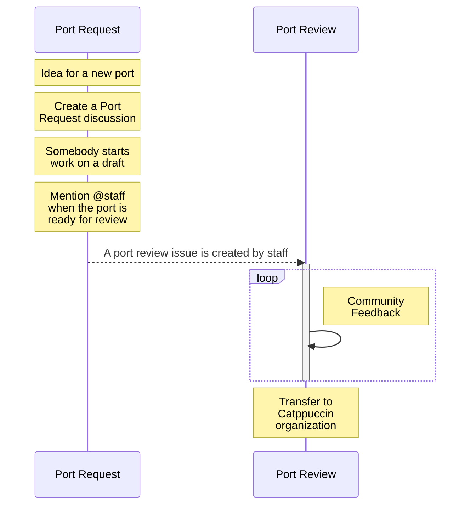
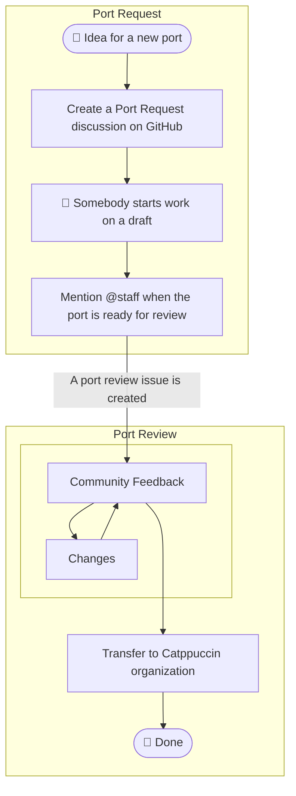

<p align="center">
  <h2 align="center">🧱 Port Creation</h2>
</p>

<p align="center">
	Guidelines for submitting and creating ports
</p>

&nbsp;

### What's a port?

A port is an adaptation of Catppuccin's palette for an app to use. Think of it
as a colorscheme for a program that styles every UI component it consists of!

&nbsp;

### Submission

> **Note** <br>
> All ports should conform to our
> [CODE OF CONDUCT](https://github.com/catppuccin/.github/blob/main/CODE_OF_CONDUCT.md)
> and we, the staff team, reserve the right to choose what ports will be
> included under the organization.

- [Workflow](#workflow) - View the ideal Catppuccin port workflow from start to
  finish!
- [FAQ](#faq) - Unsure where to start? You can find the answers to your
  questions here!
- [Styling](#styling) - Already started work on your port? Make sure you're
  following our style guidelines!
- [Licensing](#licensing) - Important information about the licensing of ports
  underneath the organization!
- [Maintenance](#maintenance) - Details on the maintenance of ports after they
  have been transferred into the organization!

### Workflow

#### (OPTION 1) Sequence Diagram



#### (OPTION 2) Flow Chart



### FAQ

**Q. I have a port that is already themed and ready for review!**

**A.** Port reviews can be raised as an issue
[here](https://github.com/catppuccin/catppuccin/issues/new?assignees=&labels=port+request%2Cready+for+review&template=port+review.md&title=Name+of+the+application%2Ftool%2Fwebsite%2Fetc.)
since the port is already themed and ready to be reviewed by our
[staff team](https://github.com/orgs/catppuccin/teams/staff/members)!

**Q. I have a request for a port to be included and/or I've started working on
it!**

**A.** Raise a discussion under main repository
[here](https://github.com/catppuccin/catppuccin/discussions/new?category=port-requests)!
The discussion will be transferred to an issue by the
[staff team](https://github.com/orgs/catppuccin/teams/staff/members) once we
have deemed the port ready to be reviewed! Feel free to join our
[Discord](https://discord.com/invite/r6Mdz5dpFc) and share it there too!

**Q. What types of ports won't be accepted?**

**A.** As a community-driven project, we want to keep a neutral environment for
all users. Therefore, **we do not accept contributions that have a religious or
political context.** However, we have no issue with our palette being used in
these contexts.

&nbsp;

### Creation

You can create ports using [this](https://github.com/catppuccin/template) public
template as a blueprint.

1. Clone template repository

   ```
   git clone https://github.com/catppuccin/template.git <name_of_your_port>
   ```

2. Navigate into the cloned repository

   ```
   cd <name_of_your_port>
   ```

3. Delete the existing remote

   ```
   git remote remove origin
   ```

4. Set up the rest of your port, and push it to your user repository!

&nbsp;

### Styling

After creating the repo successfully, it's important to style it properly to
ensure consistency:

- The name of the repo must be the app's name in `lower-kebab-case` (e.g.
  `unreal-engine` instead of `Unreal Engine`).
- Put the images under `assets/`.
- Format the repo's description as "`<emoji>` Soothing pastel theme for
  `<app name>`".
  - `<emoji>` should be an emoji that you feel represents the app best.
  - `<app name>` is the name of the app, capitalized properly.
- Add `catppuccin`, and `theme` to the topics.
- Ensure that you have generated the repository following the
  [creation](#creation) steps above.
  - Where possible, try to use
    [relative links](https://docs.github.com/en/get-started/writing-on-github/getting-started-with-writing-and-formatting-on-github/basic-writing-and-formatting-syntax#relative-links)
    for linking assets in the README.md.
  - Update badges on README.md to point towards your repository link instead of
    the template repository.
  - Add yourself to the **Thanks to** section \<3
- Ensure uppercase meta files (e.g. `README.md`)
- Don't add health files (e.g. `CODE_OF_CONDUCT.md`, `SUPPORT.md`), those are
  organization-wide files stored [here](https://github.com/catppuccin/.github).

&nbsp;

### Maintenance

We, the staff team, completely understand that submitting a port may seem
daunting for the sole purposes of the pressures of involvement in Catppuccin
past the initial transfer of your port to the organization.

We would like to re-assure you that **we do not expect maintainers to keep
maintaining their ports for the rest of eternity**. While, of course, we would
love nothing more than for you to stick around. We understand that it's not
always possible for a plethora of reasons.

When you submit your port to be merged into the organization, please think of it
as offering your port for co-maintenance involving yourself and the entirety of
the staff team!

&nbsp;

### Licensing

Any contribution will be published under the same licensing terms as the project
itself. However, there are
[exceptions to this rule](https://github.com/search?q=org%3Acatppuccin+-license%3Amit).
Please get in touch with us if that is the case with your work!

&nbsp;

### Tools

Since Catppuccin is available in 4 flavors it's understandable that it may be
difficult to make 4 versions of a port. So to help with that, we have built a
bunch of tools to make life easier when creating Catppuccin ports. You'll find
them all (with instructions) under our
[catppuccin/toolbox](https://github.com/catppuccin/toolbox) repo. An essential
tool for creating ports is
[catwalk](https://github.com/catppuccin/toolbox#catwalk), this is used to create
a layered screenshot of your port which combines all four flavors into one.
