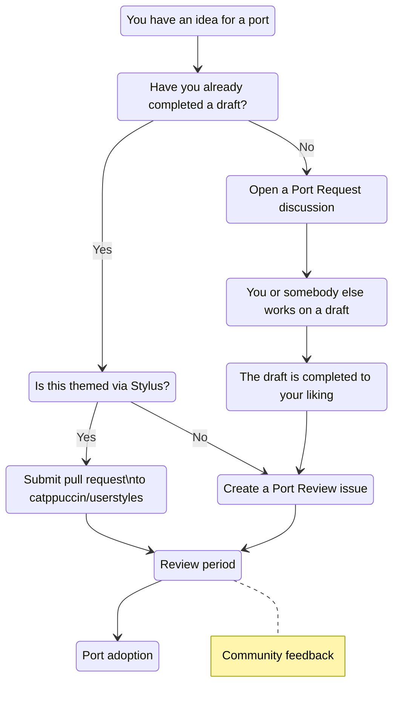

<p align="center">
  <h2 align="center">🧱 Port Creation</h2>
</p>

<p align="center">
	Guidelines for submitting and creating ports
</p>

&nbsp;

### What's a port?

A port is an adaptation of Catppuccin's palette for an app to use. Think of it
as a colorscheme for a program that styles every UI component it consists of!

### What's a userstyle?

A userstyle is, in the context of Catppuccin, a port for a website which is themed
via [Stylus](https://github.com/openstyles/stylus), you can view all of Catppuccin's
userstyles at [catppuccin/userstyles](https://github.com/catppuccin/userstyles).

> [!IMPORTANT]<br> 
> **All userstyles are ports, but not all ports are userstyles.**

&nbsp;

### Submission

> [!IMPORTANT]<br>
> All ports should conform to our
> [CODE OF CONDUCT](https://github.com/catppuccin/.github/blob/main/CODE_OF_CONDUCT.md)
> and we, the staff team, reserve the right to choose what ports will be
> included under the organization.

Read through the following headings to ensure that you're adhering to our
submission guidelines!

- [Workflow](#workflow) - View the ideal Catppuccin port workflow from start to
  finish!
- [FAQ](#faq) - Unsure where to start? You can find the answers to your
  questions here!
- [Creation](#creation) - Start creating your ports with our template
  repository!
- [Styling](#styling) - Already started work on your port? Make sure you're
  following our style guidelines!
- [Licensing](#licensing) - Important information about the licensing of ports
  underneath the organization!
- [Maintenance](#maintenance) - Details on the maintenance of ports after they
  have been transferred into the organization!

&nbsp;

### Workflow



&nbsp;

### FAQ

**Q. I have a port that is already themed and ready for review!**

**A.** Port reviews can be raised as an issue
[here](https://github.com/catppuccin/catppuccin/issues/new?assignees=&template=port-review.yml&title=Name+of+the+application%2Ftool%2Fwebsite%2Fetc.)
since the port is already themed and ready to be reviewed by our
[staff team](https://github.com/catppuccin/community/#current-structure)!

**Q. I have a userstyle that is already finished and ready for review!**

**A.** Finished userstyles should be raised via a [pull request](https://github.com/catppuccin/userstyles/compare)
to [catppuccin/userstyles](https://github.com/catppuccin/userstyles/compare). You can find further information on
how to contribute userstyles [here](https://github.com/catppuccin/userstyles/blob/main/docs/userstyle-creation.md).

**Q. I have a request for a port to be included and/or I've started working on it!**

**A.** Raise a discussion under main repository
[here](https://github.com/catppuccin/catppuccin/discussions/new?category=port-requests)!
The discussion will be transferred to an issue by the
[staff team](https://github.com/catppuccin/community/#current-structure) once we
have deemed the port ready to be reviewed! Feel free to join our
[Discord](https://discord.com/servers/catppuccin-907385605422448742) and share it there too!

**Q. What types of ports won't be accepted?**

**A.** As a community-driven project, we want to keep a neutral environment for
all users. Therefore, **we do not accept contributions that have a religious or
political context.** However, we have no issue with our palette being used in
these contexts.

&nbsp;

### Creation

You can create ports using [this](https://github.com/catppuccin/template) public
template as a blueprint.

1. Clone template repository

   ```
   git clone https://github.com/catppuccin/template.git <name_of_your_port>
   ```

2. Navigate into the cloned repository

   ```
   cd <name_of_your_port>
   ```

3. Delete the `.git` folder at the root of the repository and run `git init`. This removes the template authors from appearing as contributors to your new port.

4. Set up the rest of your port, and push it to your user repository!

&nbsp;

### Styling

After creating the repo successfully, it's important to style it properly to
ensure consistency:

- The name of the repo must be the app's name in `lower-kebab-case` (e.g.
  `unreal-engine` instead of `Unreal Engine`).
- Ensure that the default branch is set to `main`. This ensures that the
  repository is consistent with other ports across the organization.
- Put the images under `assets/`.
  - Prefer `.webp` over `.png` for images. `.webp` is a more efficient format and is supported by all major browsers.
- Format the repo's description as "`<emoji>` Soothing pastel theme for
  `<app name>`".
  - `<emoji>` should be an emoji that you feel represents the app best.
  - `<app name>` is the name of the app, capitalized properly.
- Add `catppuccin`, `theme`, and the name of the application (e.g.
  `unreal-engine`) to the topics.
- Ensure that you have generated the repository following the
  [creation](#creation) steps.
- Ensure that the port README.md is styled appropriately following the steps
  below:
  - Update [shields.io](https://shields.io/) badges to point towards your
    repository link instead of the template repository.
  - The main preview image should be an image generated by
    [catwalk](https://github.com/catppuccin/toolbox#-catwalk). (e.g.
    [vscode](https://github.com/catppuccin/vscode#catppuccin-for-vscode) and
    [discord](https://github.com/catppuccin/discord#catppuccin-for-discord))
  - Change the preview paths to use [relative links](https://github.blog/2013-01-31-relative-links-in-markup-files/)
  - Add yourself to the **Thanks to** section \<3
- Ensure uppercase meta files (e.g. `README.md`)
- Don't add health files (e.g. `CODE_OF_CONDUCT.md`, `SUPPORT.md`), those are
  organization-wide files stored [here](https://github.com/catppuccin/.github).

&nbsp;

### Maintenance

The staff team wants to let you know that we understand submitting a port may
feel overwhelming. But don't worry, **we don't expect you to keep maintaining
your port after it's been transferred to us**. We would love for you to continue
helping out, but we understand if that's not possible.

When you submit your port to be transferred, think of it as offering it up for
co-maintenance. This means you'll work with the staff team to maintain the port
together! Our main focus will be to maintain consistent quality and
accessibility standards across all ports. We'll also provide feedback on ways to
improve your port and help fix any technical issues.

&nbsp;

### Licensing

Any contribution will be published under the same licensing terms (MIT) as the
project itself. However, there are
[exceptions to this rule](https://github.com/search?q=org%3Acatppuccin+-license%3Amit).
Please get in touch with us, if the application you're theming has licensing
restrictions, or your work is a derivative of a stricter license (e.g.
[cursors](https://github.com/catppuccin/cursors#info)).

&nbsp;

### Tools

Since Catppuccin is available in 4 flavors it's understandable that it may be
difficult to make 4 versions of a port. So to help with that, we have built a
bunch of tools to make life easier when creating Catppuccin ports. You'll find
them all (with instructions) under our
[catppuccin/toolbox](https://github.com/catppuccin/toolbox) repo. An essential
tool for creating ports is
[catwalk](https://github.com/catppuccin/toolbox#-catwalk), this is used to create
a layered screenshot of your port which combines all four flavors into one.
