<p align="center">
  <h2 align="center">🧱 Port Creation</h2>
</p>

<p align="center">
	Guidelines for submitting and creating ports
</p>

&nbsp;

### What's a port?

A port is an adaptation of Catppuccin's palette for an app to use. Think of it
as a colorscheme for a program that styles every UI component it consists of!

&nbsp;

### Submission Workflow

#### (OPTION 1) Sequence Diagram


#### (OPTION 2) Flow Chart

```mermaid
flowchart TB
  idea(["💭 Idea for a new port"])
  request["Create a Port Request discussion on GitHub"]
  draft["🚧 Somebody starts work on a draft"]
  portready["Mention @staff when the port is ready for review"]
  review["Community Feedback"]
  changes["Changes"]
  transfer["Transfer to Catppuccin organization"]
  done(["🎉 Done"])

  portready --A port review issue is created--> review

  subgraph Port Review
    subgraph  
      review --> changes
      changes --> review
    end
    review ---> transfer --> done
  end

  subgraph Port Request
    idea --> request
    request --> draft
    draft --> portready
  end
```



&nbsp;

### Submission

**Q. I have a port that is already themed and ready for review!**

**A.** Port reviews can be raised as an issue [here](<>) since the port is
already themed and ready to be reviewed by our
[staff team](https://github.com/orgs/catppuccin/teams/staff/members)!

**Q. I have a suggestion for a port to be included and/or I've started working
on it!**

**A.** Raise a discussion under main repository
[here](https://github.com/catppuccin/catppuccin/discussions/new?category=port-suggestions)!
The discussion will be transferred to an issue by the
[staff team](https://github.com/orgs/catppuccin/teams/staff/members) once we
have deemed the port ready to be reviewed! Feel free to join our
[Discord](https://discord.com/invite/r6Mdz5dpFc) and share it there too!

**Q. What types of ports won't be accepted?**

**A.** All ports should conform to our
[CODE OF CONDUCT](https://github.com/catppuccin/.github/blob/main/CODE_OF_CONDUCT.md)
and we, the staff team, reserve the right to choose what ports will be included
under the organization. As a community-driven project, we want to keep a neutral
environment for all users. Therefore, **we do not accept contributions that have
a religious or political context.** However, we have no issue with our palette
being used in these contexts.

&nbsp;

### Creation

You can create ports using [this](https://github.com/catppuccin/template) public
template as a blueprint.

1. Clone template repository

   ```
   git clone https://github.com/catppuccin/template.git <name_of_your_port>
   ```

2. Navigate into the cloned repository

   ```
   cd <name_of_your_port>
   ```

3. Delete the existing remote

   ```
   git remote remove origin
   ```

4. Set up the rest of your port, and push it to your user repository!

&nbsp;

### Licensing

Any contribution will be published under the same licensing terms as the project
itself. However, there are
[exceptions to this rule](https://github.com/search?q=org%3Acatppuccin+-license%3Amit).
Please get in touch with us if that is the case with your work!

&nbsp;

### Styling

After creating the repo successfully, it's important to style it properly to
ensure consistency:

- The name of the repo must be the simplest version of the app's name (e.g.
  `nvim` instead of `NeoVim`). You may use hyphens if needed (e.g.
  `windows-files`).
- Put the images under `assets/`.
- Format the repo's description as "`<emoji>` Soothing pastel theme for
  `<app name>`".
  - `<emoji>` should be an emoji that you feel represents the app best.
  - `<app name>` is the name of the app, capitalized properly.
- Add `catppuccin`, and `theme` to the topics.
- Ensure uppercase meta files (e.g. `README.md`)
- Don't add health files (e.g. `CODE_OF_CONDUCT.md`, `SUPPORT.md`), those are
  organization-wide files stored [here](https://github.com/catppuccin/.github).

&nbsp;

### Tools

Since Catppuccin is available in 4 flavors it's understandable that it may be
difficult to make 4 versions of a port. So to help with that, we have built a
bunch of tools to make life easier when creating Catppuccin ports. You'll find
them all (with instructions) under our
[catppuccin/toolbox](https://github.com/catppuccin/toolbox) repo. An essential
tool for creating ports is
[catwalk](https://github.com/catppuccin/toolbox#catwalk), this is used to create
a layered screenshot of your port which combines all four flavors into one.
