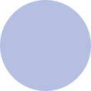

  <h2>🖌️ Style Guide</h2>
  
 A guide on how to properly <strong>use</strong> the palette 

&nbsp;

### General Usage

> [!IMPORTANT]
> Text colors are guidelines, certain cases require deviations
> from the guidelines below. An example would be `text` on colored backgrounds.
> Legibility always comes first, so please use your own judgement.

<table>
  <tr>
    <th colspan="3" align="center"><h4>Background Colors</h4></th>
  </tr>
  <tr>
    <th>Function</th>
    <th colspan="2">Colors</th>
  </tr>
  <tr>
    <td>Background Pane</td>
    <td>Base</td>
    <td>
      
      
      
      
    </td>
  </tr>
  <tr>
    <td>Secondary Panes</td>
    <td>
      Crust, 
      Mantle
    </td>
    <td>
      
      
      
       
      
      
      
      
    </td>
  </tr>
  <tr>
    <td>Surface Elements</td>
    <td>
      Surface 0, 
      Surface 1, 
      Surface 2
    </td>
    <td>
      
      
      
       
      
      
      
       
      
      
      
      
    </td>
  </tr>
  <tr>
    <td>Overlays</td>
    <td>
      Overlay 0, 
      Overlay 1, 
      Overlay 2
    </td>
    <td>
      
      
      
       
      
      
      
       
      
      
      
      
    </td>
  </tr>
  <tr>
    <th colspan="3" align="center"><h4>Typography</h4></th>
  </tr>
  <tr>
    <th>Function</th>
    <th colspan="2">Colors</th>
  </tr>
  <tr>
    <td>Body Copy</td>
    <td>Text</td>
    <td>
      
      
      
      
    </td>
  </tr>
  <tr>
    <td>Main Headline</td>
    <td>Text</td>
    <td>
      
      
      
      
    </td>
  </tr>
  <tr>
    <td>Sub-Headlines, Labels</td>
    <td>
      Subtext 0, 
      Subtext 1
    </td>
    <td>
      
      
      
       
      
      
      
      
    </td>
  </tr>
  <tr>
    <td>Subtle</td>
    <td>Overlay 1</td>
    <td>
      
      
      
      
    </td>
  </tr>
  <tr>
    <td>On Accent</td>
    <td>Base</td>
    <td>
      
      
      
      
    </td>
  </tr>
  <tr>
    <td>Links, URLs</td>
    <td>Blue</td>
    <td>
      
      
      
      
    </td>
  </tr>
  <tr>
    <td>Success</td>
    <td>Green</td>
    <td>
      
      
      
      
    </td>
  </tr>
  <tr>
    <td>Warnings</td>
    <td>Yellow</td>
    <td>
      
      
      
      
    </td>
  </tr>
  <tr>
    <td>Errors</td>
    <td>Red</td>
    <td>
      
      
      
      
    </td>
  </tr>
  <tr>
    <td>Tags, Pills</td>
    <td>Blue</td>
    <td>
      
      
      
      
    </td>
  </tr>
  <tr>
    <td>Selection Background</td>
    <td>
      Overlay 2 
      <strong>20% - 30% Opacity</strong>
    </td>
    <td>
      
      
      
      
    </td>
  </tr>
  <tr>
    <td>Cursor</td>
    <td>Rosewater</td>
    <td>
      
      
      
      
    </td>
  </tr>
</table>

### Terminals

<table>
  <tr>
    <th colspan="9" align="center"><h4>Window Colors</h4></th>
  </tr>
  <tr>
    <th></th>
    <th colspan="2">Latte</th>
    <th colspan="2">Frappé</th>
    <th colspan="2">Macchiato</th>
    <th colspan="2">Mocha</th>
  </tr>
  <tr>
    <td>Cursor</td>
    <td></td>
    <td>Rosewater</td>
    <td></td>
    <td>Rosewater</td>
    <td></td>
    <td>Rosewater</td>
    <td></td>
    <td>Rosewater</td>
  </tr>
  <tr>
    <td>Cursor Text</td>
    <td></td>
    <td>Base</td>
    <td></td>
    <td>Crust</td>
    <td></td>
    <td>Crust</td>
    <td></td>
    <td>Crust</td>
  </tr>
  <tr>
    <td>Active Border</td>
    <td></td>
    <td>Lavender</td>
    <td></td>
    <td>Lavender</td>
    <td></td>
    <td>Lavender</td>
    <td></td>
    <td>Lavender</td>
  </tr>
  <tr>
    <td>Inactive Border</td>
    <td></td>
    <td>Overlay 0</td>
    <td></td>
    <td>Overlay 0</td>
    <td></td>
    <td>Overlay 0</td>
    <td></td>
    <td>Overlay 0</td>
  </tr>
  <tr>
    <td>Bell Border</td>
    <td></td>
    <td>Yellow</td>
    <td></td>
    <td>Yellow</td>
    <td></td>
    <td>Yellow</td>
    <td></td>
    <td>Yellow</td>
  </tr>
  <tr>
    <th colspan="9" align="center"><h4>Regular Colors</h4></th>
  </tr>
  <tr>
    <th></th>
    <th colspan="2">Latte</th>
    <th colspan="2">Frappé</th>
    <th colspan="2">Macchiato</th>
    <th colspan="2">Mocha</th>
  </tr>
  <tr>
    <td>color0</td>
    <td>
    </td><td>Subtext 1</td>
    <td></td>
    <td>Surface 1</td>
    <td></td>
    <td>Surface 1</td>
    <td></td>
    <td>Surface 1</td>
  </tr>
  <tr>
    <td>color1</td>
    <td></td>
    <td>Red</td>
    <td></td>
    <td>Red</td>
    <td></td>
    <td>Red</td>
    <td></td>
    <td>Red</td>
  </tr>
  <tr>
    <td>color2</td>
    <td></td>
    <td>Green</td>
    <td></td>
    <td>Green</td>
    <td></td>
    <td>Green</td>
    <td></td>
    <td>Green</td>
  </tr>
  <tr>
    <td>color3</td>
    <td></td>
    <td>Yellow</td>
    <td></td>
    <td>Yellow</td>
    <td></td>
    <td>Yellow</td>
    <td></td>
    <td>Yellow</td>
  </tr>
  <tr>
    <td>color4</td>
    <td></td>
    <td>Blue</td>
    <td></td>
    <td>Blue</td>
    <td></td>
    <td>Blue</td>
    <td></td>
    <td>Blue</td>
  </tr>
  <tr>
    <td>color5</td>
    <td></td>
    <td>Pink</td>
    <td></td>
    <td>Pink</td>
    <td></td>
    <td>Pink</td>
    <td></td>
    <td>Pink</td>
  </tr>
  <tr>
    <td>color6</td>
    <td></td>
    <td>Teal</td>
    <td></td>
    <td>Teal</td>
    <td></td>
    <td>Teal</td>
    <td></td>
    <td>Teal</td>
  </tr>
  <tr>
    <td>color7</td>
    <td></td>
    <td>Surface 2</td>
    <td></td>
    <td>Subtext 0</td>
    <td></td>
    <td>Subtext 0</td>
    <td></td>
    <td>Subtext 0</td>
  </tr>
  <tr>
    <th colspan="9" align="center"><h4>Bold Colors <a href="#1-ansi-color-generation">1)</a></h4></th>
  </tr>
  <tr>
    <th></th>
    <th colspan="2">Latte</th>
    <th colspan="2">Frappé</th>
    <th colspan="2">Macchiato</th>
    <th colspan="2">Mocha</th>
  </tr>
  <tr>
    <td>color8</td>
    <td></td>
    <td>Subtext 0</td>
    <td></td>
    <td>Surface 2</td>
    <td>
    </td><td>Surface 2</td>
    <td></td>
    <td>Surface 2</td>
  </tr>
  <tr>
    <td>color9</td>
    <td></td>
    <td>Bright Red</td>
    <td></td>
    <td>Bright Red</td>
    <td></td>
    <td>Bright Red</td>
    <td></td>
    <td>Bright Red</td>
  </tr>
  <tr>
    <td>color10</td>
    <td></td>
    <td>Bright Green</td>
    <td></td>
    <td>Bright Green</td>
    <td></td>
    <td>Bright Green</td>
    <td></td>
    <td>Bright Green</td>
  </tr>
  <tr>
    <td>color11</td>
    <td></td>
    <td>Bright Yellow</td>
    <td></td>
    <td>Bright Yellow</td>
    <td></td>
    <td>Bright Yellow</td>
    <td></td>
    <td>Bright Yellow</td>
  </tr>
  <tr>
    <td>color12</td>
    <td></td>
    <td>Bright Blue</td>
    <td></td>
    <td>Bright Blue</td>
    <td></td>
    <td>Bright Blue</td>
    <td></td>
    <td>Bright Blue</td>
  </tr>
  <tr>
    <td>color13</td>
    <td></td>
    <td>Bright Pink</td>
    <td></td>
    <td>Bright Pink</td>
    <td></td>
    <td>Bright Pink</td>
    <td></td>
    <td>Bright Pink</td>
  </tr>
  <tr>
    <td>color14</td>
    <td></td>
    <td>Bright Teal</td>
    <td></td>
    <td>Bright Teal</td>
    <td></td>
    <td>Bright Teal</td>
    <td></td>
    <td>Bright Teal</td>
  </tr>
  <tr>
    <td>color15</td>
    <td></td>
    <td>Surface 1</td>
    <td></td>
    <td>Subtext 1</td>
    <td></td>
    <td>Subtext 1</td>
    <td></td>
    <td>Subtext 1</td>
  </tr>
  <tr>
    <th colspan="9" align="center"><h4>Extended Colors</h4></th>
  </tr>
  <tr>
    <th></th>
    <th colspan="2">Latte</th>
    <th colspan="2">Frappé</th>
    <th colspan="2">Macchiato</th>
    <th colspan="2">Mocha</th>
  </tr>
  <tr>
    <td>color16</td>
    <td></td>
    <td>Peach</td>
    <td></td>
    <td>Peach</td>
    <td></td>
    <td>Peach</td>
    <td></td>
    <td>Peach</td>
  </tr>
  <tr>
    <td>color17</td>
    <td></td>
    <td>Rosewater</td>
    <td></td>
    <td>Rosewater</td>
    <td></td>
    <td>Rosewater</td>
    <td></td>
    <td>Rosewater</td>
  </tr>
  <tr>
    <th colspan="9" align="center"><h4>Syntax Colors</h4></th>
  </tr>
  <tr>
    <th></th>
    <th colspan="2">Latte</th>
    <th colspan="2">Frappé</th>
    <th colspan="2">Macchiato</th>
    <th colspan="2">Mocha</th>
  </tr>
  <tr>
    <td>Mark 1</td>
    <td></td>
    <td>Lavender</td>
    <td></td>
    <td>Lavender</td>
    <td></td>
    <td>Lavender</td>
    <td></td>
    <td>Lavender</td>
  </tr>
  <tr>
    <td>Mark 1 Text</td>
    <td></td>
    <td>Base</td>
    <td></td>
    <td>Crust</td>
    <td></td>
    <td>Crust</td>
    <td></td>
    <td>Crust</td>
  </tr>
  <tr>
    <td>Mark 2</td>
    <td></td>
    <td>Mauve</td>
    <td></td>
    <td>Mauve</td>
    <td></td>
    <td>Mauve</td>
    <td></td>
    <td>Mauve</td>
  </tr>
  <tr>
    <td>Mark 2 Text</td>
    <td></td>
    <td>Base</td>
    <td></td>
    <td>Crust</td>
    <td></td>
    <td>Crust</td>
    <td></td>
    <td>Crust</td>
  </tr>
  <tr>
    <td>Mark 3</td>
    <td></td>
    <td>Sapphire</td>
    <td></td>
    <td>Sapphire</td>
    <td></td>
    <td>Sapphire</td>
    <td></td>
    <td>Sapphire</td>
  </tr>
  <tr>
    <td>Mark 3 Text</td>
    <td></td>
    <td>Base</td>
    <td></td>
    <td>Crust</td>
    <td></td>
    <td>Crust</td>
    <td></td>
    <td>Crust</td>
  </tr>
</table>

#### 1) ANSI Color Generation

> [!NOTE] 
> These bright colors are not necessarily "brighter" than the normal colors, but rather more bold and saturated.

The ANSI brights, excluding `black` and `white`, are automatically generated based on the following formulas:

<table>
  <tr>
    <th>Mocha, Macchiato, Frappé</th>
    <th>Latte</th>
  </tr>
  <tr>
    <td>
<pre><code>color.lightness * 0.94
color.chroma + 8
color.hue + 2</code></pre>
    </td>
    <td>
<pre><code>color.lightness * 1.09
 
color.hue + 2</code></pre>
    </td>
  </tr>
</table>

The color values for `black` and `white` are mapped as shown below:

<table>
  <tr>
    <th>Mocha, Macchiato, Frappé</th>
    <th>Latte</th>
  </tr>
  <tr>
    <td>
      Black (0): <code>Surface 1</code> 
      Black (8): <code>Surface 2</code> 
      White (7): <code>Subtext 0</code> 
      White (15): <code>Subtext 1</code>
    </td>
    <td>
      Black  (0): <code>Subtext 1</code> 
      Black  (8): <code>Subtext 0</code> 
      White  (7): <code>Surface 2</code> 
      White (15): <code>Surface 1</code>
    </td>
  </tr>
</table>

### Code Editors

> [!IMPORTANT]
> **This is still a work-in-progress.** Additionally, it's
> important to acknowledge that different editors have different capabilities
> for theming, please use your own judgement in accordance with the main colors
> defined below.

<table>
  <tr>
    <td>
      <table>
        <tr>
          <th colspan="3" align="center">
            <h4>Language Defaults</h4>
          </th>
        </tr>
        <tr>
          <th>Syntax</th>
          <th colspan="2">Color</th>
        </tr>
        <tr>
          <td>Keyword</td>
          <td>Mauve</td>
          <td>
            
            
            
            
          </td>
        </tr>
        <tr>
          <td>Strings</td>
          <td>Green</td>
          <td>
            
            
            
            
          </td>
        </tr>
        <tr>
          <td>Symbols, Atoms</td>
          <td>Red</td>
          <td>
            
            
            
            
          </td>
        </tr>
        <tr>
          <td>
            Escape Sequences 
            Regex
          </td>
          <td>Pink</td>
          <td>
            
            
            
            
          </td>
        </tr>
        <tr>
          <td>Comments</td>
          <td>Overlay 2</td>
          <td>
            
            
            
            
          </td>
        </tr>
        <tr>
          <td>Constants, Numbers</td>
          <td>Peach</td>
          <td>
            
            
            
            
          </td>
        </tr>
        <tr>
          <td>Operators</td>
          <td>Sky</td>
          <td>
            
            
            
            
          </td>
        </tr>
        <tr>
          <td>Braces, Delimiters</td>
          <td>Overlay 2</td>
          <td>
            
            
            
            
          </td>
        </tr>
        <tr>
          <td>Methods, Functions</td>
          <td>Blue</td>
          <td>
            
            
            
            
          </td>
        </tr>
        <tr>
          <td>Parameters</td>
          <td>Maroon</td>
          <td>
            
            
            
            
          </td>
        </tr>
        <tr>
          <td>Builtins</td>
          <td>Red</td>
          <td>
            
            
            
            
          </td>
        </tr>
        <tr>
          <td>
            Classes, Interfaces, 
            Annotations, Metadata, 
            Enums, Types
          </td>
          <td>Yellow</td>
          <td>
            
            
            
            
          </td>
        </tr>
        <tr>
          <td>Enum Variants</td>
          <td>Teal</td>
          <td>
            
            
            
            
          </td>
        </tr>
        <tr>
          <td>
            Property 
            (e.g. JSON keys)
          </td>
          <td>Blue</td>
          <td>
            
            
            
            
          </td>
        </tr>
        <tr>
          <td>
            Attributes 
            (e.g. XML-style attributes)
          </td>
          <td>Yellow</td>
          <td>
            
            
            
            
          </td>
        </tr>
        <tr>
          <td>
            Macros
          </td>
          <td>Rosewater</td>
          <td>
            
            
            
            
          </td>
        </tr>
      </table>
    </td>
    <td>
      <table>
        <tr>
          <th colspan="3" align="center">
            <h4>General</h4>
          </th>
        </tr>
        <tr>
          <th>Syntax</th>
          <th colspan="2">Color</th>
        </tr>
        <tr>
          <td>Cursor</td>
          <td>Rosewater</td>
          <td>
            
            
            
            
          </td>
        </tr>
        <tr>
          <td>Cursor Line</td>
          <td>
            Text 
            <strong>10% Opacity</strong>
          </td>
          <td>
            
            
            
            
          </td>
        </tr>
        <tr>
          <td>Line Numbers</td>
          <td>Overlay 1</td>
          <td>
            
            
            
            
          </td>
        </tr>
        <tr>
          <td>Active Line Number</td>
          <td>Lavender</td>
          <td>
            
            
            
            
          </td>
        </tr>
        <tr>
          <td>
            Normal Links 
            Followed Links 
            On Hover Links
          </td>
          <td>
            Blue 
            Lavender 
            Sky
          </td>
          <td>
            
            
            
             
            
            
            
             
            
            
            
            
          </td>
        </tr>
        <tr>
          <td>
            Search FG 
            Search BG 
            Active Search FG 
            Active Search BG
          </td>
          <td>
            Text 
            Teal 
            Text 
            Red
          </td>
          <td>
            
            
            
             
            
            
            
             
            
            
            
             
            
            
            
            
          </td>
        </tr>
        <tr>
          <td>Errors</td>
          <td>Red</td>
          <td>
            
            
            
            
          </td>
        </tr>
        <tr>
          <td>Warnings</td>
          <td>Yellow Peach</td>
          <td>
            
            
            
             
            
            
            
            
          </td>
        </tr>
        <tr>
          <td>Information</td>
          <td>Teal</td>
          <td>
            
            
            
            
          </td>
        </tr>
      </table>
    </td>
  </tr>
</table>

<table>
  <tr>
    <td>
      <table>
        <tr>
          <th colspan="3" align="center">
            <h4>
              Rainbow Highlights 
              (Brackets, Headings, etc.)
            </h4>
          </th>
        </tr>
        <tr>
          <th>Syntax</th>
          <th colspan="2">Color</th>
        </tr>
        <tr>
          <td>Color #1</td>
          <td>Red</td>
          <td>
            
            
            
            
          </td>
        </tr>
        <tr>
          <td>Color #2</td>
          <td>Peach</td>
          <td>
            
            
            
            
          </td>
        </tr>
        <tr>
          <td>Color #3</td>
          <td>Yellow</td>
          <td>
            
            
            
            
          </td>
        </tr>
        <tr>
          <td>Color #4</td>
          <td>Green</td>
          <td>
            
            
            
            
          </td>
        </tr>
        <tr>
          <td>Color #5</td>
          <td>Sapphire</td>
          <td>
            
            
            
            
          </td>
        </tr>
        <tr>
          <td>Color #6</td>
          <td>Lavender</td>
          <td>
            
            
            
            
          </td>
        </tr>
      </table>
    </td>
    <td>
      <table>
        <tr>
          <th colspan="3" align="center">
            <h4>Rainbow Parameters &  Local Variables</h4>
          </th>
        </tr>
        <tr>
          <th>Syntax</th>
          <th colspan="2">Color</th>
        </tr>
        <tr>
          <td>Color #1</td>
          <td>60% Text/Red Mix</td>
          <td>
            
            
            
            
          </td>
        </tr>
        <tr>
          <td>Color #2</td>
          <td>60% Text/Yellow Mix</td>
          <td>
            
            
            
            
          </td>
        </tr>
        <tr>
          <td>Color #3</td>
          <td>60% Text/Green Mix</td>
          <td>
            
            
            
            
          </td>
        </tr>
        <tr>
          <td>Color #4</td>
          <td>60% Text/Teal Mix</td>
          <td>
            
            
            
            
          </td>
        </tr>
        <tr>
          <td>Color #5</td>
          <td>60% Text/Blue Mix</td>
          <td>
            
            
            
            
          </td>
        </tr>
        <tr>
          <td>Color #6</td>
          <td>60% Text/Mauve Mix</td>
          <td>
            
            
            
            
          </td>
        </tr>
      </table>
    </td>
  </tr>
</table>

<table>
  <tr>
    <th colspan="3" align="center">
      <h4>Diff & Merge</h4>
    </th>
  </tr>
  <tr>
    <th>Function</th>
    <th colspan="2">Color</th>
  </tr>
  <tr>
    <td>
      Diff Header
    </td>
    <td>
      Blue
    </td>
    <td>
      
      
      
      
    </td>
  </tr>
  <tr>
    <td>
      Index Metadata
    </td>
    <td>
      Overlay2
    </td>
    <td>
      
      
      
      
    </td>
  </tr>
  <tr>
    <td>
      File Path Markers
    </td>
    <td>
      Pink
    </td>
    <td>
      
      
      
      
    </td>
  </tr>
  <tr>
    <td>
      Hunk Header
    </td>
    <td>
      Peach
    </td>
    <td>
      
      
      
      
    </td>
  </tr>
  <tr>
    <td>
      Changed Text BG 
      Changed Line BG
    </td>
    <td>
      Blue <strong>(10% - 20% Opacity)</strong> 
      Blue <strong>(15% - 25% Opacity)</strong>
    </td>
    <td>
      
      
      
       
      
      
      
      
    </td>
  </tr>
  <tr>
    <td>
      Inserted Text BG 
      Inserted Line BG
    </td>
    <td>
      Green <strong>(10% - 20% Opacity)</strong> 
      Green <strong>(15% - 25% Opacity)</strong>
    </td>
    <td>
      
      
      
       
      
      
      
      
    </td>
  </tr>
  <tr>
    <td>
      Removed Text BG 
      Removed Line BG
    </td>
    <td>
      Red <strong>(10% - 20% Opacity)</strong> 
      Red <strong>(15% - 25% Opacity)</strong>
    </td>
    <td>
      
      
      
       
      
      
      
      
    </td>
  </tr>
</table>

<table>
  <tr>
    <th colspan="3" align="center">
      <h4>Debugging</h4>
    </th>
  </tr>
  <tr>
    <th>Function</th>
    <th colspan="2">Color</th>
  </tr>
  <tr>
    <td>Breakpoint Icon</td>
    <td>Red</td>
    <td>
      
      
      
      
    </td>
  </tr>
  <tr>
    <td>Breakpoint Line</td>
    <td>Transparent</td>
    <td>--------------</td>
  </tr>
  <tr>
    <td>Breakpoint Line During Execution</td>
    <td>Yellow <strong>15% Opacity</strong></td>
    <td>
      
      
      
      
    </td>
  </tr>
</table>
